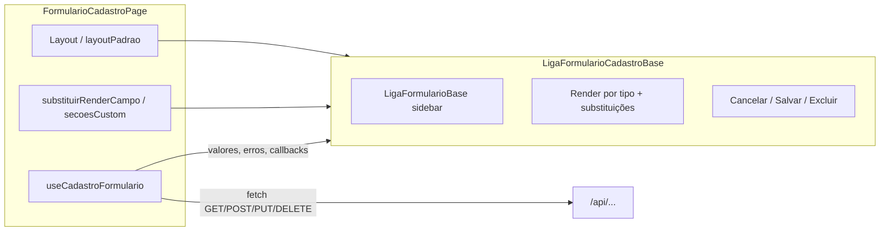

# Padrão de formulário de cadastro / edição (referência: Unidade de atendimento)

**Fonte canônica** das regras de formulário CRUD no domínio `padroes-ui`: este arquivo está em **`Rules.manifest.json`** (concatenação para `POST /ai/generate`). Índice geral: [`../../Rules-indice.md`](../../Rules-indice.md); árvore `forms/`: [`../README.md`](../README.md).

Este documento descreve **layout por seções**, **disciplina de texto e UX** (rótulos, seções, agrupamentos, subtítulo do topo), **tipos de campo**, **validação** (incluindo máscaras/dígitos), **auditoria**, **ações (Cancelar / Salvar / Excluir)** e **integração BFF**, alinhado ao código atual do frontend. O exemplo principal é o cadastro de **unidade de atendimento**; outras features reutilizam os mesmos building blocks mudando **`LayoutFormularioCadastro`**, **`substituirRenderCampo`**, **`secoesCustom`**, **endpoint** e **i18n**. Para **lookup + cartão de resumo em `fieldset`** (ex.: cliente / convênio / contato), ver **[`cartao-selecao.md`](cartao-selecao.md)** (também no `Rules.manifest.json`).

**Código de referência**

| Papel | Caminho |
|--------|---------|
| Página exemplo | `web/src/app/unidade-atendimento/formulario-cadastro/page.tsx` |
| Layout declarativo (seções, tipos, labels via i18n) | `web/src/app/unidade-atendimento/unidadeAtendimentoLayoutPadrao.ts` |
| Casca UI + renderização por `tipo` + barra de ações | `web/src/components/formulario-cadastro/LigaFormularioCadastroBase.tsx` |
| Estilos base | `web/src/components/formulario-cadastro/liga-formulario-cadastro-base.css` |
| Classes semânticas de input (readonly, auditoria, chave automática) | `web/src/components/formulario-cadastro/ligaFormularioCampos.ts` |
| Hook ciclo de vida (GET/POST/PUT/DELETE, erros, auditoria no corpo) | `web/src/hooks/useCadastroFormulario.ts` |
| Validação de obrigatórios na ordem das seções | `web/src/lib/formulario-cadastro-obrigatorios.ts` |
| Normalização mascarada → API | `web/src/lib/mascara-para-api.ts` (`somenteDigitos`, `digitosOuNulo`) |
| Calendário: painel compacto, parse/format só dia ou ISO com hora | `web/src/lib/calendario-datas-formulario.ts` (`LIGA_CALENDARIO_PANEL_CLASS`, `parseValorCalendarioSomenteDia`, `formatarDateCalendarioSomenteDia`, `parseIsoParaDateComHora`) |
| Anti-autocomplete / sugestão do navegador em inputs | `web/src/lib/input-sem-sugestao-browser.ts` (`atributosSemSugestaoBrowser`) |
| MultiSelect + modal PickList (padrão canônico) | `web/src/components/ui/selecao/LigaMultiSelectComModalLista.tsx` |
| Tipos `CampoFormularioCadastro`, `LayoutFormularioCadastro` | `web/src/types/formulario-cadastro.types.ts` |
| Mescla layout persistido × padrão | `web/src/hooks/useLayoutFormulario.ts` |
| Formulário shell (sidebar de seções, foco) | `web/src/components/formulario-base/LigaFormularioBase.tsx` |
| Combobox de pesquisa + inclusão em tabela (`LigaLookupCombobox`) | `web/src/components/formulario-cadastro/LigaLookupCombobox.tsx` |
| Avanço de foco após lookup (próximo campo editável) | `web/src/lib/foco-proximo-campo-formulario.ts` (`agendarFocarProximoCampoEditavel`, `focarProximoCampoEditavel`) |

---

## Visão geral do fluxo

1. A página define **`estadoVazio`**, chama **`useCadastroFormulario`** com `endpoint` (BFF), `tela` (identificação interna / mensagens), `validarAntesSalvar`, `prepararCorpoSalvar`, `aposCarregarDados`, etc.
2. Opcionalmente usa **`useLayoutFormulario(codigo)`** para carregar layout persistido por perfil; quando `layout.secoes` vem vazio, prevalece o **`layoutPadrao`** da feature (factory que recebe `t` / chaves i18n).
3. **`LigaFormularioCadastroBase`** combina `layout` com **`layoutPadrao`**, monta seções na sidebar, renderiza campos por **`tipo`** ou delega a **`substituirRenderCampo`** / **`secoesCustom`**.
4. O hook executa **GET** `/:id` na edição, **POST** ou **PUT** no salvar, **DELETE** na exclusão; injeta campos de auditoria no corpo no momento do salvamento; traduz **400** com `errors` em mapa por campo (`traduzirErrosValidacaoParaFormulario`).

---

## 1. Estrutura de seções e ordem

- As seções vêm de **`LayoutFormularioCadastro`** (`secoes: SecaoFormularioCadastro[]`): cada item tem `id`, `titulo`, `descricao`, `icone`, `campos` e opcionalmente `grupos` / `tituloGrupoCheckbox`.
- **`LigaFormularioCadastroBase`** usa `layout.secoes.length > 0 ? layout : layoutPadrao` — ou seja, layout persistido substitui o padrão quando traz seções; caso contrário mantém-se o arquivo de layout da feature.
- Conteúdo alternativo por seção: mapa **`secoesCustom[idSecao]`** substitui inteiramente o render automático daquela seção.

### 1.1 Regra fixa: Auditoria sempre por último

- **Regra de produto / UX:** a seção cuja função é **Auditoria** deve ser **sempre a última** no array `secoes` do layout. Novas seções de negócio devem ser inseridas **antes** dela.
- **Implementação:** não há sort automático no código; a garantia é **disciplina no `LayoutFormularioCadastro`** (e em migrações de layout persistido).
- **Exceção visível no código:** usuários **sem** `sessao.podeVerSecaoAuditoriaFormulario` **não veem** a seção com `id === "auditoria"` (filtro em `LigaFormularioCadastroBase`). Em modo **`navegacaoSecoes === "etapasHorizontais"`**, a seção `auditoria` **não entra no wizard** (fica fora das etapas).

### 1.2 Rótulos (`label`), títulos de seção e agrupamentos

- **Rótulos dos campos:** curtos, em linguagem de usuário ou de negócio. **Não** usar sufixos técnicos entre parênteses no `label` (ex.: "(Inteiro)", "(S/N)", "(FK)") — tipo, formato e obrigatoriedade ficam a cargo do `tipo` / componente e da marcação visual do formulário.
- **Cada seção** (`SecaoFormularioCadastro`: `titulo` + `descricao` opcional): deve dar contexto para quem preenche (ex.: "Dados principais da unidade"). **Evitar** nomes de tabelas, colunas ou entidades de banco como texto principal do bloco.
- **Grupos visuais** (`grupos` em seção, `tituloGrupoCheckbox`, blocos com classes de grupo de checkbox em CSS): **não** criar agrupamentos só por hábito de modelagem. Agrupar quando o fluxo de preenchimento pede (ex.: par **Início / Fim**, conjunto de **checkbox** relacionados). Títulos de grupo em linguagem natural; **evitar** repetir nome de campo cru ou nome de entidade como título decorativo.

### 1.3 Formulário mestre–detalhe: aba **Principal** + abas de detalhe

#### Quando usar

- Aplicar **somente** quando o cadastro tiver estrutura **mestre–detalhe**: registro **pai** + um ou mais **blocos filhos** com vida própria na UI.
- **Não** exibir a faixa de abas de primeiro nível nem a aba **Principal** quando o formulário **não** tiver detalhes nesse sentido: o CRUD simples continua só com **sidebar + seções**, sem essa toolbar.

#### Onde aparece na UI

- A faixa horizontal fica em **`liga-formulario-abaixo-topo`**, no mesmo slot usado por outras barras abaixo do título.
- Estrutura típica: `div.liga-home-abas-lista` com `role="tablist"` e rótulo ARIA do tipo **"Áreas do formulário"** — chaves i18n em **`home.formulario.abasTopo`** (`abasRaizAria`, `abaPrincipal`).
- Ordem sugerida na faixa: **Principal** primeiro; em seguida, uma aba por bloco de detalhe.

#### Comportamento da aba **Principal**

- Corresponde ao **formulário mestre**: sidebar + todas as seções do pai que **não** são exclusivas das abas de detalhe (ou seja, seções **sem** `ocultarNaSidebar`).
- É o modo "cadastro completo" do mestre, alinhado ao layout habitual do `LigaFormularioCadastroBase` / `LigaFormularioBase` com **`navegacaoSecoes="sidebar"`** (padrão).

#### Comportamento das outras abas (detalhes)

- Cada aba representa um **detalhe** (ou família de detalhes) como se fosse um **painel próprio**: conteúdo na mesma casca visual do mestre. Quando o detalhe for grande, pode-se compor com **`LigaFormularioBase` aninhado** e `navegacaoSecoes="sidebar"` para sidebar interna + subseções.
- **Campos de auditoria do cadastro mestre** permanecem na aba **Principal** (seção `auditoria` no layout do pai, sem `ocultarNaSidebar`). **Não** duplicar seção de auditoria nos detalhes sem regra de produto explícita.

#### Contrato técnico

- No layout declarativo (`SecaoFormularioCadastro`), seções que são **somente** acessíveis pela faixa do topo usam **`ocultarNaSidebar: true`** (`web/src/types/formulario-cadastro.types.ts`).
- O **`LigaFormularioCadastroBase`** deriva **`idsSecoesSomenteAbasTopo`** a partir dessas seções e repassa ao **`LigaFormularioBase`** na prop homônima.
- O **`LigaFormularioBase`** expõe a constante **`LIGA_FORMULARIO_ABA_PRINCIPAL_RAIZ`** para a aba sintética **Principal**, renderiza a faixa só quando há pelo menos um id em `idsSecoesSomenteAbasTopo`, e mantém coerência entre faixa raiz, **`secaoAtiva`** e sidebar.

#### Persistência: uma transação para mestre + detalhes

- **Contrato desejado:** ao salvar, **mestre e todos os detalhes** enviados no mesmo corpo devem **gravar juntos** ou **falhar juntos**. Se qualquer validação ou escrita de filho falhar, **nenhuma** alteração do lote deve permanecer no banco.
- **Frontend:** um único **POST/PUT** ao endpoint do mestre com o payload agregando filhos. Não persistir detalhes em chamadas separadas que deixem o pai em estado inconsistente.
- **Backend:** implementar o salvamento com **transação** (`prisma.$transaction` ou equivalente), atualizando/inserindo/removendo filhos **dentro** do mesmo callback de transação após regras e validações.
- **Alinhamento:** regra global do repositório (mestre + detalhe em transação); UI mestre–detalhe pressupõe esse contrato.

---

## 2. Padrões por tipo de campo

### 2.1 Calendário (`tipo: "data"`) — estilo visual único

- **Regra:** todo campo de data em formulário CRUD que use o pipeline declarativo (`LigaFormularioCadastroBase` + `tipo: "data"`) deve manter a **mesma casca visual** que a base: PrimeReact **`Calendar`** com `className="p-inputtext-sm w-full liga-campo-com-botao-interno"`, **`panelClassName={LIGA_CALENDARIO_PANEL_CLASS}`** (`liga-datepicker-panel--compact`, ver `liga-formulario-cadastro-base.css`), ícone, barra de botões, `dateFormat="dd/mm/yy"`, máscara `99/99/9999` quando **sem** horário.
- **Estado / API:** conversões em `@/lib/calendario-datas-formulario`: sem `dataComHorario` → `YYYY-MM-DD` via `parseValorCalendarioSomenteDia` / `formatarDateCalendarioSomenteDia`; com `dataComHorario: true` → ISO completo (`parseIsoParaDateComHora` / `toISOString()` no `onChange`).
- **Proibição:** não introduzir outro "calendário de cadastro" com DOM ou skin diferente salvo exceção de produto documentada na própria feature.

### 2.2 MultiSelect (padrão canônico)

- **Componente:** `LigaMultiSelectComModalLista` — único padrão para seleção múltipla em formulários quando o produto exige lista grande com filtro e conferência em modal.
- **Comportamento:** Prime **`MultiSelect`** com `display="chip"`, **`filter`**, `filterPlaceholder`, `showSelectAll`; botão interno (ícone lista) abre **`Dialog`** com **`PickList`** (colunas "Não selecionados" / "Selecionados", filtros nos dois lados); **Cancelar** / **Confirmar** no rodapé do modal.

### 2.3 Somente leitura / ID / edição condicional

- **`tipo: somenteLeitura`** na base: `InputText` / `InputTextarea` **desabilitados**, classe via **`classeInputSomenteLeitura`** — auditoria (`endereco_ip_auditoria`, `nome_aplicacao_auditoria`, `id_usuario_auditoria`) usa **`LIGA_FORM_CLASS_INPUT_AUDITORIA`**; demais read-only genéricos usam **`LIGA_FORM_CLASS_INPUT_READONLY`**.
- **Chave automática / ID:** `obrigatorio_sistema` aplica **`LIGA_FORM_CLASS_INPUT_CHAVE_AUTOMATICA`**.

### 2.4 Select de lista pequena

- **`tipo: select`** no layout: Prime **`Dropdown`** em `LigaFormularioCadastroBase`, `optionLabel` / `optionValue`, `placeholder`, **`showClear`**.

### 2.5 Campo Ativo (padrão global)

- **`tipo: ativo`:** Prime **`InputSwitch`**; estado interno derivado de **`valorAtivoParaSwitch`** (`true` se valor é `true`, `"S"` ou `"s"`).
- **Colocação:** deve ficar na seção **Identificação** e ser **o último campo** da lista dessa seção no layout.
- **Novo registro:** o estado vazio da feature deve inicializar **`ativo: "S"`** (ou equivalente aceito pelo hook/API). No **salvar**, normalizar para payload (**`ativoParaSnPayload`** / conversão semelhante em `prepararCorpoSalvar`).

### 2.6 Máscaras (CEP, CNPJ, telefone, celular)

- Prime **`InputMask`** (ex.: CEP `99999-999`, CNPJ `99.999.999/9999-99`).
- **Telefone / celular:** máscara dinâmica conforme **`somenteDigitos(valor).length > 10`** → `(99) 99999-9999` senão `(99) 9999-9999`.
- **Regra:** quando o domínio define formato conhecido, **sempre** usar máscara na UI e **`somenteDigitos`** / **`digitosOuNulo`** (`@/lib/mascara-para-api`) no payload.

### 2.7 Senha sem critério forte no cliente

- **`tipo: senha`:** componente **`InputSenhaCadastroSemSugestao`** — `type="text"` + classes CSS de mascaramento (evita gerenciador de senhas do browser); botão olho com textos `home.formulario.senhaCadastroMostrar` / `senhaCadastroOcultar`.
- Não há validação de complexidade neste padrão — apenas UX.

### 2.8 Checkbox / flags S/N

- Backend **S/N:** na UI usar **`Checkbox`** + helpers **`valorCheckboxMarcadoNaUi`** / conversão explícita no **`prepararCorpoSalvar`** (`true` → `"S"`).
- **Exceção:** **Ativo** na identificação usa **`tipo: ativo`**, não checkbox.
- **Agrupamento:** usar **`tituloGrupoCheckbox`** na seção ou blocos com classes **`liga-formulario-checkbox-grupo`**, **`liga-formulario-checkbox-grupo-titulo`**, **`liga-formulario-checkbox-grupo-interior`**.

### 2.9 Campos exclusivamente numéricos (`tipo: "numero"`)

- Na base, **`tipo: "numero"`** usa PrimeReact **`InputNumber`** (`useGrouping={false}`, `maxFractionDigits={0}`), adequado para **bloquear letras** na entrada.

### 2.10 Texto longo (`tipo: "textarea"`)

- **`LigaFormularioCadastroBase`:** `InputTextarea` com `className="p-inputtext-sm w-full"`, `rows={linhas ?? 3}`, `data-campo-chave`, `invalid` ligado ao erro, **`{...atributosSemSugestaoBrowser()`}**.
- **Largura na grade:** quando o campo deve ocupar a linha inteira, usar **`colunas: 1`** no layout (classe container **`liga-formulario-campo-linha-toda`** via `classeCampoContainer`).

### 2.11 Autocomplete e sugestões do navegador

- **Regra:** inputs editáveis de cadastro **não** devem expor o formulário ao preenchimento automático / dropdown de histórico do browser.
- **Padrão de código:** espalhar **`{...atributosSemSugestaoBrowser()`}** (`web/src/lib/input-sem-sugestao-browser.ts`) em `InputText` e `InputTextarea` já tratados na base.
- **Senha:** `tipo: "senha"` usa **`InputSenhaCadastroSemSugestao`** — estratégia própria para reduzir interferência de gerenciadores.

---

## 3. Validação e obrigatoriedade

- **Cliente antes do POST/PUT:** `validarAntesSalvar` no **`useCadastroFormulario`**; se retornar mapa não vazio, o hook define **`erros`**, incrementa **`pulsoSincroniaErrosCampos`**, exibe toast **`home.feedback.toastValidacaoCampos`** e **não** chama a API.
- **Ordem das validações:** usar **`errosCamposObrigatoriosPorOrdemSecoes`** (`formulario-cadastro-obrigatorios.ts`) com as **seções efetivas** do layout. Assim, a **primeira pendência** segue a ordem visual do formulário.
- **Máscaras e quantidade de dígitos antes do envio:** para CEP, CPF, CNPJ, telefone etc., **`validarAntesSalvar`** deve garantir **contagem de dígitos** coerente com a máscara — usando **`somenteDigitos`** (`@/lib/mascara-para-api`).
- **Sincronização aba / foco (`pulsoSincroniaErrosCampos`):** quando o hook ou a validação cliente preenche erros após **Salvar**, o contador dispara um efeito na base que: calcula a **primeira chave com erro na ordem do layout**, ativa a **seção** correspondente momentaneamente e chama **`focarCampoComChaveQuandoMontado`**.

---

## 4. Auditoria (última seção)

- **Campos típicos:** `id_tenacidade`, `id_usuario_auditoria`, `endereco_ip_auditoria`, `nome_aplicacao_auditoria` — todos **somente leitura** na UI.
- **FK na exibição (somente leitura):** formato **`ID - descrição`** em **`InputText` com `disabled`** (estilo auditoria / inativo), **sem** ícone de lupa nem papel de combobox — o mesmo padrão visual para **tenacidade** e **usuário**.
- **Tenacidade:** preferir **ID + razão social** quando o lookup auxiliar retorna.
- **Usuário auditoria:** **ID + nome** via `GET /api/usuarios/:id`; em falha da API, **fallback** com e-mail da sessão (`/api/auth/sessao`).
- **Endereço IP (`endereco_ip_auditoria`):** deve refletir o **IPv4 da interface de rede local da estação** (o que costuma aparecer em `ipconfig` / `ip addr`), **não** `127.0.0.1` / `::1`. O frontend tenta obter esse IP no browser com **WebRTC** (`descobrirIpv4RedeLocalCliente`); o backend valida (IPv4, não loopback) e **prefere** esse valor ao gravar `endereco_ip_auditoria`.

---

## 5. Cancelar, Salvar, Excluir

- **`codigoTela`:** prop obrigatória na base para **`usePermissaoPerfilTelaAtiva`** — controla incluir / editar / excluir e mensagens quando o perfil bloqueia.
- **Estados globais:** `desabilitado = carregando || salvando || excluindo || ocultarPersistencia`; botões respeitam isso.
- **Cancelar:** outlined, ícone `pi-times`, chama **`aoFechar`**; desabilitado durante `salvando` / `excluindo`.
- **Salvar:** valida permissão (`usePermissaoPerfilTelaAtiva` — incluir vs editar); **`loading`** quando `salvando`.
- **Sucesso:** toast **`feedback.salvo()`** e **`aoFechar`** se `fecharAposSalvar` (default `true` no hook).
- **Exclusão:** só com **`idEdicao`**; confirmação via **`LigaMensagemPopUp`** (`home.formulario.tituloConfirmarExclusaoCadastro`, `confirmarExclusaoCadastro`, `botaoConfirmarExclusaoCadastro`).
- **400 com erros por campo:** `traduzirErrosValidacaoParaFormulario` + mapa em `erros` + toast de validação; incrementa **`pulsoSincroniaErrosCampos`**.

---

## 6. i18n e subtítulo

### 6.1 Subtítulo da tela (`LayoutFormularioCadastro.subtituloNovo` / `subtituloEditar`)

- Props repassadas por **`LigaFormularioCadastroBase`** para **`LigaFormularioBase`**: `subtitulo={ idEdicao ? layoutEfetivo.subtituloEditar : layoutEfetivo.subtituloNovo }`.
- **DOM:** o subtítulo é um **`
`** com **`title={subtitulo}`** igual ao texto visível — tooltip nativo no hover.
- **Inclusão:** texto orientado à **ação**, em segunda pessoa quando fizer sentido, **alinhado ao nome da entidade já presente no título**.
- **Edição:** idem, focado em atualização.
- **Mestre–detalhe:** **`subtituloNovo`** e **`subtituloEditar`** devem referir-se **apenas ao cadastro pai**. **Não** usar o subtítulo para listar filhos.
- **Contexto na edição:** o **título** visível é **`tituloEditar` + parênteses com o complemento** quando a página repassa **`tituloEdicaoComplemento`** → `tituloComContexto` na base no formato **`{tituloEditar} ({tituloEdicaoComplemento})`**.

---

## 7. Integração com o domínio `padroes-ui`

- Este README consta de **`ai/domains/padroes-ui/Rules.manifest.json`** na ordem do array (após `forms/listagem/README.md`), como as demais entradas concatenadas em `POST /ai/generate`.
- Documentação complementar (planejada): **`Rules-formulario-sidebar.md`**, **`Rules-componentes-campos.md`**, **`Rules-mensagens-erros.md`** — adicionar quando o template for evoluindo.
