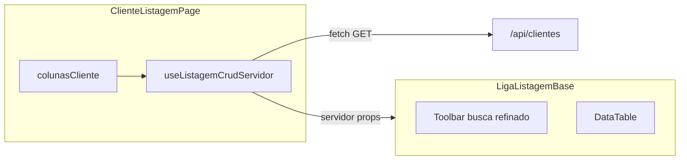

# Padrão de tela de listagem (referência: Cliente)

**Fonte canônica** das regras de listagem no domínio `padroes-ui`: este arquivo está em **`Rules.manifest.json`** (concatenação para `POST /ai/generate`). Índice geral: [`../../Rules-indice.md`](../../Rules-indice.md); árvore `forms/`: [`../README.md`](../README.md).

Este documento descreve **layout, textos (i18n), interações e contrato HTTP** do padrão atual de listagem CRUD no frontend, usando a listagem de **cliente** como exemplo canônico. Outras features (usuários, unidades, etc.) reutilizam os mesmos componentes alterando **colunas**, **"Pesquisar por"**, **filtros refinados** e **endpoint** — o comportamento da casca permanece o mesmo.

**Código de referência**

| Papel | Caminho |
|--------|---------|
| Página exemplo | `web/src/app/cliente/listagem/page.tsx` |
| UI compartilhada | `web/src/components/formulario-pesquisa/LigaListagemBase.tsx` |
| Estilos | `web/src/components/formulario-pesquisa/liga-listagem-base.css` |
| Tipos (`LigaColunaListagem`, filtros) | `web/src/components/formulario-pesquisa/liga-listagem.types.ts` |
| Filtro refinado no cliente (modo memória) | `web/src/components/formulario-pesquisa/liga-listagem-filtro-refinado.ts` |
| Drawer + formulário do refinado | `web/src/components/formulario-pesquisa/LigaListagemFiltroRefinadoSidebar.tsx` |
| Chips de filtros ativos | `web/src/components/formulario-pesquisa/LigaListagemBarraFiltrosAtivos.tsx` |
| Estado + `fetch` servidor | `web/src/hooks/useListagemCrudServidor.ts` |
| Montagem da query | `web/src/lib/listagem-servidor-query.ts` |

---

## Visão geral do fluxo

1. A página define **`LigaColunaListagem[]`** e chama o hook com `resourcePath` e `campoPesquisaInicial`.
2. O hook mantém paginação, termo/campo de busca e filtros refinados serializados; dispara **`fetch`** quando esses parâmetros mudam.
3. `LigaListagemBase` renderiza cabeçalho, barra de ferramentas, drawer de filtro refinado, chips e grade; em modo servidor repassa busca/filtros ao hook via callbacks.

---

## 1. Estrutura visual (layout)

### 1.1 Raiz da tela

- Elemento: `<section class="liga-listagem-base" aria-labelledby="liga-listagem-titulo-principal">`.
- CSS (`liga-listagem-base.css`): flex em coluna, `gap`, `flex: 1`, `min-height: 0` para a lista ocupar o painel sem estourar o shell.

### 1.2 Cabeçalho da página

- Bloco: `header.liga-listagem-pagina-cabecalho`.
- **Linha do título** (`liga-listagem-titulo-linha`): flex, espaço entre extremidades.
  - **Esquerda** (`liga-listagem-titulo-esquerda`): barra vertical verde (`liga-listagem-barra-verde`, 4px) + **`h1`** `liga-listagem-titulo-principal`.
    - Opcional: ícone Prime antes do texto (`iconeTitulo`, classe `pi` + `liga-listagem-titulo-icone`).
  - **Direita** (`liga-listagem-titulo-acoes`): só aparece se houver exportação e/ou `aoNovo`.
    - **Exportar:** `Button` outlined, classe `liga-listagem-botao-export-dropdown`, ícone `pi-download`, rótulo `home.listagem.comum.exportar`, seta `pi-angle-down`. Abre `Menu` popup com:
      - **CSV** — `listagem.comum.exportarCsv`, executa export nativo do `DataTable`.
      - **PDF** — `listagem.comum.exportarPdf`, **desabilitado**, `title` = `listagem.comum.exportarPdfEmBreve`.
    - **Desabilitar exportar** quando `ordenados.length === 0` (tooltip com `listagem.comum.nenhumRegistro`).
    - **Novo:** `Button` com `icon="pi pi-plus"`, `label={textoBotaoNovo}`.
- **Subtítulo** opcional: `p.liga-listagem-subtitulo` (prop `subtitulo`); pode ser omitido quando o título já identifica a tela.

### 1.3 Barra de ferramentas (busca, refinado, colunas)

- Bloco: `div.liga-listagem-barra-ferramentas`.
- Conteúdo principal: `div.liga-listagem-barra-metade-tela.liga-listagem-barra-ferramentas--busca-e-novo` — linha única com rolagem horizontal se necessário.
- **Ordem dos controles (esquerda → direita):**
  1. **Toggle filtro refinado** — `button.liga-listagem-refinado-toggle` (só se `habilitarFiltroRefinado` e existir coluna com `filtroRefinado`). Ícone `pi-chevron-right` fechado / `pi-chevron-left` aberto. `aria-expanded`, `aria-controls="liga-listagem-refinado-drawer"`, `title` = `listagem.comum.filtroRefinadoAlternar`.
  2. **Dropdown "Pesquisar por"** — Prime `Dropdown` com classe `liga-listagem-pesquisar-por`, **somente** em `fonteListagem === "servidor"` e se existir ao menos uma coluna com `pesquisaServidor: true`. Opções = cabeçalhos das colunas elegíveis; valor = índice. `aria-label` = `listagem.comum.pesquisarPor`.
  3. **Caixa de busca rápida** — `div.liga-listagem-busca-wrap` > `div.liga-listagem-busca.liga-listagem-busca-com-icones` com `role="search"`.
     - Input: `InputText` ou `InputMask` (se a coluna ativa tiver máscara de busca), classe `liga-listagem-busca-input`, placeholder dinâmico, `title` = `listagem.comum.buscaAplicarComEnter`.
     - **À direita do input:** `div.liga-listagem-busca-acoes-direita` — botão **limpar** (`pi-times`, `aria-label` = `listagem.comum.limparBusca`) se houver texto ou termo já aplicado; botão **aplicar** (`pi-search`, `aria-label` = `listagem.comum.buscaAplicar`).
  4. **MultiSelect de colunas** — só se existir coluna com `ocultavel !== false`. Classe `liga-listagem-seletor-colunas`, `display="chip"`, `placeholder` = `listagem.comum.colunasPlaceholder`, `aria-label` = `listagem.comum.colunasVisiveis`.

> **Nota sobre Prime `{0}` vs ICU (next-intl):** vários componentes do Prime usam placeholders numéricos `{0}` na mesma string que a app passa por `t(...)`. Para o **next-intl**, isso é sintaxe ICU; sem valor `0` ocorre `FORMATTING_ERROR`. **Solução:** no JSON, tratar `{0}` como literal com aspas ICU (`'{0}'`), ou evitar `t()` nessa string.

### 1.4 Chips de filtros refinados ativos

- Abaixo da linha de busca, quando há filtros com valor: componente `LigaListagemBarraFiltrosAtivos` (rótulos via `rotuloChipFiltroRefinado`, overflow com botão "⋯", opção de remover filtro individual ou limpar).

### 1.5 Drawer "Filtro refinado"

- Quando o toggle abre o painel: `button.liga-listagem-refinado-backdrop` (fecha ao clicar) + `aside#liga-listagem-refinado-drawer.liga-listagem-refinado-drawer` com `role="dialog"` e `aria-modal="true"`.
- Topo: título `listagem.comum.filtroRefinadoTitulo` + botão fechar (`listagem.comum.fechar`, ícone `pi-times`); ao fechar, foco retorna ao toggle.
- Corpo: `LigaListagemFiltroRefinadoSidebarForm` — um controle por coluna que declara `filtroRefinado` (texto, inteiro, decimal, data, intervalo, enum).

### 1.6 Grade (DataTable)

- Moldura: `div.liga-listagem-moldura-tabela`.
- Prime `DataTable` com classe `liga-listagem-grid`:
  - **`dataKey`**: prop `chavePrimaria` (ex.: `"id"`).
  - **Coluna de ações** (primeira, se `aoAcaoLinha` e `ariaLabelAcaoLinha`): cabeçalho sr-only `listagem.comum.colunaAcoes`, largura fixa ~3.465rem, botão `liga-listagem-acao-icone` — ícone `pi-pencil` (edição), `pi-eye` (somente consulta) ou `pi-check` (modo seleção).
  - Demais colunas: `field`, `header`, `sortable` conforme `LigaColunaListagem`, `stripedRows`, estilos de largura/alinhamento/quebra de linha.
  - **Paginador:** `paginatorPosition="bottom"`, `lazy` no modo servidor, `rowsPerPageOptions` default `[5, 10, 20, 50]`, `paginatorTemplate` com First/Prev/CurrentPageReport/Next/Last/RowsPerPageDropdown, `currentPageReportTemplate` = `listagem.comum.paginacaoIntervalo`.
  - **Vazio:** `emptyMessage` = prop `textoNenhumRegistro`.
  - **Carregando:** overlay com `LigaListagemCarregandoSplash`.

---

## 1.7 Listagem embutida (modal / lookup / aba da home)

Quando `LigaListagemBase` aparece **fora** de uma rota dedicada (Dialog de lookup, painel lateral, aba `LigaSistemaAbas` / `LigaHomeNavegacao`), mantenha a **mesma casca** (toolbar, busca, seletor de colunas, grade com paginação) e o namespace **`home`** + chaves em `web/src/app/(comum)/i18n/mensagens/pt-BR.json`.

### Layout e overflow

- A raiz continua sendo `section.liga-listagem-base` (flex em coluna, `min-height: 0`).
- Em **Dialog** do PrimeReact, aplique no conteúdo do modal a classe **`liga-listagem-dialogo-conteudo`** (`contentClassName="liga-listagem-dialogo-conteudo"`). O CSS associa `.p-dialog-content.liga-listagem-dialogo-conteudo` a `max-height`, `overflow: hidden` e repassa `flex` + `min-height: 0` ao filho `.liga-listagem-base`.

### Largura do modal

- Modais que hospedam **listagem CRUD completa** (servidor, várias colunas, ação por linha) devem priorizar **largura confortável na viewport**, não um modal "estreito" que force **rolagem horizontal** na grade sem necessidade.
- **Padrão recomendado** no `Dialog`: `style={{ width: "min(96vw, 1200px)" }}`.

### Maximizar / restaurar (PrimeReact `Dialog`)

- Nos modais de listagem (`contentClassName="liga-listagem-dialogo-conteudo"`), use **`maximizable`** no `Dialog`.
- O PrimeReact exibe no cabeçalho o botão de **maximizar** (`p-dialog-header-maximize`); o **mesmo** botão passa a **restaurar** o tamanho/posição quando o modal está expandido (toggle).

### Foco inicial no modal (busca rápida)

- Ao abrir um **Dialog** que contém `LigaListagemBase`, o foco deve ir para o **input da busca rápida** (`.liga-listagem-busca-wrap` / `role="search"`), não para o botão fechar do modal nem para outro controle do cabeçalho do Prime.
- O PrimeReact aplica **foco automático** no diálogo depois do primeiro paint; a base trata isso em `LigaListagemBase`: deteta ancestral `.p-dialog` e **reaplica** foco + seleção no campo de busca em instantes posteriores (`requestAnimationFrame` e `setTimeout` curtos).
- **Lookup / busca avançada:** quando o modal abre a partir de um campo (`LigaLookupCombobox`: lupa, Enter sem resultados, blur opcional), o foco pode voltar ao lookup antes da listagem "ganhar". O padrão é: no **`Dialog`**, `onShow={() => bumpTick()}` e repassar à página de listagem embutida **`reforcoFocoBusca={tick}`** (contador que incrementa a cada abertura).
- Para desativar o comportamento (caso raro), use a prop **`focoCampoBuscaAoMontar={false}`**.

---

## 2. Comportamento e interações

### 2.1 Estados iniciais e foco

- Ao montar, o input da busca recebe **foco e seleção** de texto (`useLayoutEffect` + `buscaWrapperRef`), salvo se `focoCampoBuscaAoMontar={false}`.
- Em listagem dentro de **`Dialog` Prime** (ancestral `.p-dialog`), o foco é **reaplicado** algumas vezes após a montagem para prevalecer sobre o foco automático do modal (ver §1.7).
- `buscaInicial` (prop): sincroniza `entradaBusca` e `termoBuscaAplicado` e zera `first` (paginação cliente).

### 2.2 Busca rápida no servidor

- **Aplicar:** Enter / NumpadEnter na caixa (capturado em `onKeyDownCapture`) ou clique na **lupa** → `aplicarQuickSearch()`.
- Montagem do payload: coluna ativa do dropdown = `colunasComPesquisaServidor[indiceCampoPesquisa]`; campo da API = `campoConsulta ?? campo`.
- Se a coluna tiver máscara (`mascaraBuscaServidor` ou inferida): valida com `validarTermoBuscaMascara`; em falha, `feedback.aviso(t(chaveI18n))`.
- Sucesso: `normalizarTermoBuscaServidor` → `aoPesquisarServidor({ termo, campoPesquisa })` e `setTermoBuscaAplicado(termo)` para **destaque** nas células.

### 2.3 Busca automática CPF/CNPJ (sem Enter)

- `useEffect` dedicado: se modo servidor, máscara ativa **cpf** ou **cnpj**, e o número de dígitos atinge 11 (CPF) ou 14 (CNPJ), agenda **`setTimeout(..., 400)`** ms e chama `aplicarQuickSearch`.

### 2.4 Limpar busca

- Botão **X**: `limparQuickSearch` — zera entrada e termo aplicado, reset de página/linhas no modo memória; no servidor chama `aoPesquisarServidor({ termo: "", campoPesquisa })`.

### 2.5 Troca do dropdown "Pesquisar por"

- `onChange` do Dropdown: atualiza `indiceCampoPesquisa` e chama `aoCampoPesquisaServidorChange(api)` com `campoConsulta ?? campo`.
- No hook **`useListagemCrudServidor`**: `setPesquisaSrv({ termo: "", campo })` e `setPrimeiroIndice(0)`.
- Na UI, quando o índice muda: **limpa** `entradaBusca` e `termoBuscaAplicado` (evita buscar com termo pensado para outra coluna).

### 2.6 Placeholder dinâmico da busca

- Com servidor e dropdown: usa `listagem.comum.buscaPlaceholderPorCampo` com parâmetro `campo` = cabeçalho da coluna passado por `rotuloParaPlaceholderBusca`.
- Caso contrário: usa a prop `placeholderBusca`.

### 2.7 Filtro refinado (modo servidor)

- Estado local em `LigaListagemBase`: `filtrosRefinado` (mapa campo → `LigaFiltroRefinadoValor | undefined`).
- Quando existe `aoFiltrosRefinadoServidor`:
  - **Não** se aplica `aplicarFiltrosRefinados` no cliente sobre as linhas — a API deve devolver dados já filtrados.
  - Propagação ao pai: após mudanças em `filtrosRefinado`, usa **`setTimeout` de 2000 ms** antes de chamar `aoFiltrosRefinadoServidor(filtros)`.
  - **Exceção — consulta imediata:** se o número de critérios ativos **diminuiu** (usuário removeu filtro), chama o pai **na hora** (sem esperar 2s).

### 2.8 Filtro refinado (modo memória)

- Se **não** houver `aoFiltrosRefinadoServidor`, os filtros aplicam-se no cliente com `aplicarFiltrosRefinados`.

### 2.9 Ordenação

- `onSort` do `DataTable` atualiza `ordenacaoCampo` e `ordenacaoOrdem`; a lista exibida é `ordenados` = sort **em memória** sobre `filtrados`.
- **Limitação importante (modo servidor):** só existem na memória as linhas da **página atual** retornada pela API. Para ordenação global é necessário contrato na API.

### 2.10 Paginação servidor

- `useListagemCrudServidor` calcula `pagina = floor(primeiroIndice / linhasPagina)` e monta a query; `aoPaginar` atualiza `primeiroIndice` e `linhasPorPagina` → `useEffect` refaz o `fetch` com `AbortController`.

### 2.11 Permissões, sessão e tela

- `codigoTela`: integra com `usePermissaoPerfilTelaAtiva` para **incluir** / **editar** / **excluir**.
- Enquanto sessão ou permissões carregam: splash de carregamento.
- **Novo** e **ação de linha** passam por `executarComPrecheckSessao` e, se sem permissão, `feedback.aviso` com texto de perfil.

### 2.12 Modo seleção (lookup / modal)

- Quando a página recebe `aoSelecionarRegistro`: `modoSelecao` fica true; hook usa `?todos=1` e **não** passa `fonteListagem: servidor` (lista completa para escolha).
- Ação da linha: ícone check; `permitirNovoEmModoSelecao` permite "Novo" inline abrindo formulário em modal.

---

## 3. Contrato HTTP (listagem CRUD padrão)

Função `montarSearchParamsListagemPadrao` (`web/src/lib/listagem-servidor-query.ts`):

| Parâmetro | Significado |
|-----------|-------------|
| `cargaInicial` | Default `primeiraPagina`. |
| `pagina` | Índice 0-based da página. |
| `tamanhoPagina` | Linhas por página. |
| `q` | Termo de busca rápida (só se não vazio). |
| `campoPesquisa` | Nome do campo na API (**whitelist no backend** — deve coincidir com o que o endpoint aceita; não inventar nomes sem olhar o serviço Nest). |
| `filtroRefinado` | JSON stringificado: objeto campo → valor tipado (`LigaFiltroRefinadoValor` em `liga-listagem.types.ts`). |

**Modo seleção:** requisição com `todos=1` na URL base do recurso.

**Resposta esperada pelo hook:** JSON com `dados` (array de registros) e `total` (número total no servidor para paginação).

---

## 4. O que customizar em uma nova listagem

1. **Nova página** em `web/src/app/<feature>/listagem/page.tsx`: função que monta `LigaColunaListagem[]` com `pesquisaServidor`, `filtroRefinado`, formatos e `corpoCelula` conforme o domínio.
2. **`useListagemCrudServidor`:** `resourcePath` do BFF, `campoPesquisaInicial` alinhado à primeira coluna de busca desejada.
3. **`LigaListagemBase`:** `codigoTela` coerente com permissões, textos i18n da feature, `ordenacaoInicial`, opcionalmente `habilitarExportacao`, `habilitarFiltroRefinado`, `habilitarSeletorColunas`.
4. **Backend:** aceitar os mesmos nomes em `campoPesquisa` e chaves de `filtroRefinado` que a UI envia; documentar whitelist por recurso.

---

## 5. Referência no domínio `padroes-ui`

- Ingestão por IA: ordem de concatenação em `ai/domains/padroes-ui/Rules.manifest.json` (este README entra após `Rules-indice.md`).
- Outros tópicos de UI (shell, formulário, componentes, erros): arquivos `Rules-*.md` na raiz de `padroes-ui`, listados no índice (planejados conforme a evolução do template).
