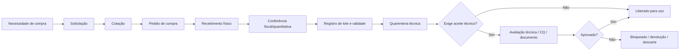
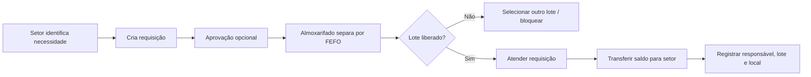
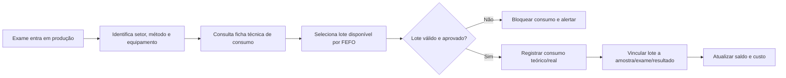
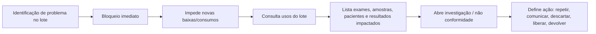
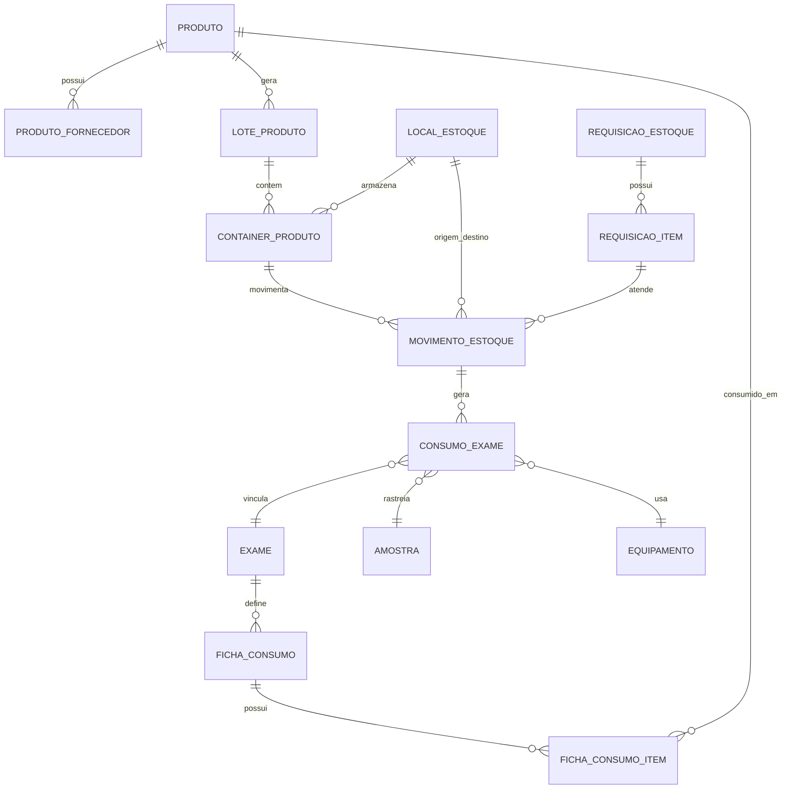

# Pesquisa e requisitos para o módulo de Estoque do Infotime-web

**Projeto:** Infotime-web  
**Módulo:** Estoque / Suprimentos Laboratoriais  
**Contexto:** ERP/LIS para laboratórios clínicos, anatomia patológica, patologia clínica, medicina diagnóstica, centros de diagnóstico e operações híbridas clínica + laboratório  
**Data de geração:** 2026-05-08  
**Autor:** ChatGPT, a partir de pesquisa de mercado, referências regulatórias e documentação interna disponível do InfoLab/Infotime  
**Uso pretendido:** fonte de informações e documento-base para concepção, priorização e especificação do módulo de estoque no projeto Infotime-web  

---

## Sumário

1. [Resumo executivo](#1-resumo-executivo)  
2. [Premissa central](#2-premissa-central)  
3. [Escopo e limitações desta pesquisa](#3-escopo-e-limitações-desta-pesquisa)  
4. [Base interna observada no InfoLab/Infotime](#4-base-interna-observada-no-infolabinfotime)  
5. [Conceitos: LIS, LIMS e ERP](#5-conceitos-lis-lims-e-erp)  
6. [Benchmark de mercado: Brasil, América Latina e exterior](#6-benchmark-de-mercado-brasil-américa-latina-e-exterior)  
7. [O que o benchmark ensina para o Infotime-web](#7-o-que-o-benchmark-ensina-para-o-infotime-web)  
8. [Por que estoque laboratorial é diferente de estoque comum](#8-por-que-estoque-laboratorial-é-diferente-de-estoque-comum)  
9. [Referências regulatórias e de qualidade](#9-referências-regulatórias-e-de-qualidade)  
10. [O que é importante controlar no estoque](#10-o-que-é-importante-controlar-no-estoque)  
11. [Tipos de produtos e insumos a controlar](#11-tipos-de-produtos-e-insumos-a-controlar)  
12. [Modelo ideal para o estoque do ERP Infotime](#12-modelo-ideal-para-o-estoque-do-erp-infotime)  
13. [Fluxos operacionais recomendados](#13-fluxos-operacionais-recomendados)  
14. [Regras de negócio obrigatórias](#14-regras-de-negócio-obrigatórias)  
15. [Requisitos funcionais detalhados](#15-requisitos-funcionais-detalhados)  
16. [Requisitos não funcionais](#16-requisitos-não-funcionais)  
17. [Modelo conceitual de dados](#17-modelo-conceitual-de-dados)  
18. [Integrações internas do Infotime-web](#18-integrações-internas-do-infotime-web)  
19. [Integrações externas recomendadas](#19-integrações-externas-recomendadas)  
20. [Indicadores e painéis gerenciais](#20-indicadores-e-painéis-gerenciais)  
21. [Funcionalidade diferencial: ficha técnica de consumo por exame](#21-funcionalidade-diferencial-ficha-técnica-de-consumo-por-exame)  
22. [Perfis de usuário e permissões](#22-perfis-de-usuário-e-permissões)  
23. [Auditoria, rastreabilidade e compliance](#23-auditoria-rastreabilidade-e-compliance)  
24. [Priorização sugerida por fases](#24-priorização-sugerida-por-fases)  
25. [Backlog inicial sugerido](#25-backlog-inicial-sugerido)  
26. [Critérios de aceite por macrofuncionalidade](#26-critérios-de-aceite-por-macrofuncionalidade)  
27. [Riscos de produto e mitigação](#27-riscos-de-produto-e-mitigação)  
28. [Perguntas para validação com usuários e stakeholders](#28-perguntas-para-validação-com-usuários-e-stakeholders)  
29. [Glossário](#29-glossário)  
30. [Fontes e referências](#30-fontes-e-referências)  

---

## 1. Resumo executivo

O módulo de estoque do Infotime-web deve ser tratado como um componente estratégico de gestão laboratorial, não apenas como um cadastro de produtos com entrada e saída.

Em laboratórios clínicos, patologia clínica, anatomia patológica e centros de diagnóstico, o estoque tem impacto direto em:

- custo operacional;
- risco de ruptura;
- desperdício por vencimento;
- qualidade analítica;
- rastreabilidade de resultados;
- conformidade regulatória;
- produtividade técnica;
- tempo de liberação de laudos;
- segurança do paciente;
- controle financeiro por exame, setor, unidade, equipamento e convênio.

Um estoque laboratorial ideal não controla somente **quanto existe**. Ele controla:

- **o que existe**;
- **onde está**;
- **em qual lote**;
- **com qual validade**;
- **em qual condição de armazenamento**;
- **se está aprovado para uso**;
- **quem movimentou**;
- **por que movimentou**;
- **qual exame consumiu**;
- **qual paciente/amostra/resultado foi impactado**;
- **quando deve repor**;
- **qual o custo real por exame**;
- **qual o risco de vencimento, ruptura ou não conformidade**.

A recomendação principal deste documento é posicionar o módulo como:

> **Suprimentos Laboratoriais e Rastreabilidade de Insumos do Infotime-web**

e não apenas como “Estoque”.

A promessa de produto deve ser:

> **Controlar o ciclo completo do insumo laboratorial: compra, recebimento, lote, validade, armazenamento, aprovação técnica, consumo por exame, rastreabilidade até o resultado e análise de custo.**

---

## 2. Premissa central

A premissa central é que, no ambiente laboratorial, um insumo não é equivalente a uma mercadoria comum.

Um produto em estoque pode estar fisicamente disponível, mas tecnicamente indisponível se estiver:

- vencido;
- sem lote informado;
- sem aceite técnico;
- em quarentena;
- reprovado pelo controle de qualidade;
- armazenado fora da condição recomendada;
- bloqueado por recall;
- com validade pós-abertura expirada;
- fracionado sem identificação;
- sem rastreabilidade documental;
- incompatível com o equipamento, método ou exame.

Portanto, o saldo disponível do Infotime-web deve considerar pelo menos três dimensões:

1. **Saldo físico:** quantidade existente no local.
2. **Saldo contábil:** quantidade e valor reconhecidos para fins de controle financeiro/contábil.
3. **Saldo técnico disponível:** quantidade efetivamente liberada para uso laboratorial.

O terceiro saldo é o que diferencia um estoque laboratorial maduro.

---

## 3. Escopo e limitações desta pesquisa

### 3.1. Escopo

Este documento cobre:

- análise de práticas de LIS, LIMS e ERP voltadas a laboratórios;
- levantamento de fornecedores nacionais e internacionais relevantes;
- interpretação de tendências funcionais de mercado;
- requisitos ideais para o estoque do Infotime-web;
- recomendações de fluxos, regras de negócio, entidades e indicadores;
- backlog inicial para implantação incremental.

### 3.2. Limitações

Esta pesquisa não deve ser interpretada como lista literalmente exaustiva de todos os softwares LIS/LIMS do mundo. O mercado global é amplo, regionalizado e possui soluções locais, hospitalares, acadêmicas, industriais, públicas, open-source e proprietárias. O levantamento abaixo é representativo e foca fornecedores relevantes ou úteis como referência funcional para o projeto.

Também não substitui:

- parecer jurídico/regulatório;
- validação de requisitos com laboratório real;
- auditoria de código legado;
- validação formal de aderência à RDC 786/2023, ISO 15189, PALC, DICQ, ONA, CAP, CLIA ou normas equivalentes;
- desenho técnico definitivo de arquitetura e banco de dados.

### 3.3. Critério de leitura

A pergunta principal que guia este documento é:

> “Que funcionalidades de estoque fariam sentido para um ERP Infotime, inicialmente voltado a laboratórios e centros de diagnóstico, e como isso deve evoluir para ser competitivo frente a LIS/LIMS modernos?”

---

## 4. Base interna observada no InfoLab/Infotime

A documentação interna disponível do projeto InfoLab/Infotime indica que o sistema já possui uma base funcional importante de estoque.

No menu do InfoLab Cliente, o módulo **Estoque** aparece com as seguintes rotinas:

- Indicador estoque;
- Controle requisição;
- Baixa de produtos;
- Entrada de produtos;
- Implantação/correção de estoque;
- Transferência de produtos;
- Cotações;
- Inventários;
- Produtos;
- Ficha Kardex;
- Relatório baixa de produtos;
- Relatório requisição de estoque.

Também aparecem cadastros relacionados ao domínio de estoque, como:

- Almoxarifados;
- Classificação de produtos;
- Fabricantes;
- Fornecedores;
- Grupos de produtos;
- Motivos de baixa;
- Tipo de movimento de requisição;
- Volumes.

A documentação de inventário dos formulários também identifica itens de estoque, como:

- formulário de baixa de produtos;
- formulário de classificação de produtos;
- controle de requisição produto;
- cadastro de almoxarifado;
- produtos;
- rotinas de inventário e Kardex.

### 4.1. Interpretação

O sistema atual não parte do zero. Ele já possui um esqueleto de ERP/estoque tradicional com cadastros, movimentações e relatórios.

A evolução recomendada é transformar esse estoque tradicional em um estoque laboratorial especializado, adicionando:

- lote;
- validade;
- validade pós-abertura;
- status técnico;
- aceite de lote;
- bloqueio de lote;
- rastreabilidade até exame/amostra/resultado;
- consumo por exame;
- consumo por equipamento;
- previsão de reposição;
- integração com CQ;
- indicadores de custo e desperdício.

---

## 5. Conceitos: LIS, LIMS e ERP

### 5.1. LIS

LIS significa **Laboratory Information System** ou Sistema de Informação Laboratorial.

Em laboratórios clínicos, o LIS é normalmente centrado em:

- cadastro do paciente;
- pedido médico;
- atendimento;
- coleta;
- etiquetas;
- amostras;
- triagem;
- interfaceamento;
- mapas/listas de trabalho;
- lançamento e validação de resultados;
- liberação de laudos;
- entrega de resultados;
- faturamento laboratorial;
- integração com laboratórios de apoio;
- controle de qualidade;
- rastreabilidade do processo pré-analítico, analítico e pós-analítico.

O LIS é, portanto, fortemente **patient-centric** e **result-centric**.

### 5.2. LIMS

LIMS significa **Laboratory Information Management System**.

É mais comum em:

- indústria farmacêutica;
- pesquisa;
- biotecnologia;
- genômica;
- alimentos e bebidas;
- petróleo e gás;
- laboratórios ambientais;
- saúde pública;
- biobancos;
- controle de qualidade industrial;
- laboratórios de contrato;
- pesquisa translacional.

O LIMS é normalmente mais **sample-centric** e **workflow-centric**, com foco em:

- amostras;
- lotes;
- cadeia de custódia;
- equipamentos;
- protocolos;
- reagentes;
- materiais;
- armazenamento;
- estudos;
- experimentos;
- auditoria;
- compliance.

### 5.3. ERP

ERP significa **Enterprise Resource Planning**.

No contexto de laboratório, o ERP cobre:

- compras;
- estoque;
- financeiro;
- contas a pagar;
- contas a receber;
- faturamento;
- notas fiscais;
- centro de custo;
- contratos;
- fornecedores;
- indicadores gerenciais;
- gestão administrativa.

### 5.4. Implicação para o Infotime-web

O Infotime-web tem oportunidade de ser um ERP laboratorial com integração profunda ao LIS.

A diferença competitiva não está apenas em “ter estoque”, mas em conectar estoque com:

- exame;
- método;
- equipamento;
- setor;
- controle de qualidade;
- amostra;
- laudo;
- custo;
- compra;
- fornecedor;
- validade;
- lote.

---

## 6. Benchmark de mercado: Brasil, América Latina e exterior

### 6.1. Fornecedores e soluções no Brasil e América Latina

| Fornecedor / solução | Tipo predominante | Pontos relevantes para o Infotime-web |
|---|---:|---|
| Pixeon / Korus LIS | LIS / gestão laboratorial | Plataforma modular, operação integrada, BI, centro de controle laboratorial e gestão administrativa/financeira com suprimentos para saúde. |
| Matrix Diagnosis / Matrix Saúde | LIS | Diferencia LIS de ERP; reforça complementaridade entre gestão laboratorial e estoque/financeiro. |
| Shift LIS | LIS para medicina diagnóstica | Plataforma para análises clínicas, imagem, anatomia patológica e imunização; foco em rastreabilidade, gestão integrada e eficiência. |
| Autolac | LIS / gestão laboratorial | Oferece módulos de recepção, laudos, financeiro e controle de estoque; voltado a laboratórios brasileiros. |
| Hotsoft Labplus / SoftLIS | LIS / integração SCC | SoftLIS é apresentado no Brasil como software laboratorial da SCC Soft Computer, com rastreabilidade, alto volume, interfaceamento e gestão administrativa. |
| Marsoft LABOL | LIS brasileiro | Solução histórica no Brasil para laboratórios de pequeno, médio e grande porte; laudos, faturamento, CQ, interfaceamento e rastreabilidade. |
| SSLAB / Saúde Systems | LIS | Atendimento, coleta, área técnica, laudos e faturamento TISS integrados. |
| Lyzen ERP/LIS | ERP + LIS | Apresenta estoque e compras com insumos, validade, consumo por procedimento, requisições e reposição inteligente. |
| LabCoreSoft / LabCore | LIS/LIMS LatAm | Atua em saúde humana, animal, patologia e indústria; destaca rastreabilidade, segurança, faturamento, HL7/XML/JSON e módulos de patologia. |
| Dedalus DNLAB / InVitro | LIS global/LatAm | LIS para laboratório clínico e microbiologia, multi-site, com inventário de produtos, gestão de equipamentos, documentos, método e auditoria. |
| Biobyte ETHOS-LIS | LIS | Interfaceamento, integração com apoio, rastreabilidade total, faturamento e fluxo completo da operação laboratorial. |

### 6.2. Fornecedores internacionais relevantes

| Fornecedor / solução | Tipo predominante | Pontos relevantes para o Infotime-web |
|---|---:|---|
| Clinisys Laboratory Solution / Sunquest / Orchard | LIS/LIMS | Plataforma moderna e configurável para fluxos LIS e LIMS; amostras, workflow, dados, CQ, compliance e analytics. |
| SCC Soft Computer / SoftLab / SoftTotalQC | LIS + CQ + inventário | SoftLab para ambientes hospitalares e multisite; SoftTotalQC controla CQ de controles, reagentes, meios, painéis, drogas, consumíveis e manutenção, com inventário. |
| Epic Beaker | LIS hospitalar | Forte em integração com prontuário Epic, patologia clínica e anatomia patológica; referência em operação hospitalar integrada. |
| Oracle Health PathNet | LIS hospitalar | Ecossistema laboratorial hospitalar integrado a HIS/EHR e operações clínicas. |
| Dedalus InVitro | LIS | Gestão laboratorial, inventário de produtos, método, documento, auditoria, integração hospitalar. |
| LabWare LIMS | LIMS | Inventário de químicos e consumíveis com quantidade, localização, validade e fornecedor. |
| LabVantage LIMS | LIMS | Gestão de consumíveis por tipo, lote, container, validade, aprovação, localização, reordem e código de barras. |
| Thermo Scientific SampleManager LIMS | LIMS | Controle de estoque de reagentes e consumíveis, validade, quantidade, alertas de baixo estoque, pedidos e informações de segurança. |
| STARLIMS | LIMS / clinical informatics | Rastreabilidade de amostras, inventário, armazenamento, workflows, analytics e compliance. |
| Sapio LIMS | LIMS / diagnostics / research | Inventário de reagentes, lotes, validade, níveis de reposição, cadeia de custódia, rastreabilidade de material usado em workflows. |
| LabKey LIMS | LIMS / inventory | Inventário de amostras, reagentes e consumíveis, localização física, validade, quantidade remanescente, uso e trilha de auditoria. |

### 6.3. Conclusão do benchmark

O benchmark mostra três níveis de maturidade:

1. **LIS básico com estoque anexo**  
   Controla entrada, saída, financeiro e relatórios.

2. **LIS/ERP com estoque operacional**  
   Controla produtos, requisições, validade, fornecedores, compras e indicadores.

3. **LIS/LIMS maduro com estoque técnico-laboratorial**  
   Controla lote, validade, localização, status de aceite, CQ, uso por exame/amostra, cadeia de custódia, recall, consumo teórico x real e reposição inteligente.

A recomendação é que o Infotime-web evolua para o terceiro nível.

---

## 7. O que o benchmark ensina para o Infotime-web

### 7.1. O estoque deve ser orientado a lote

Praticamente toda solução madura de laboratório trata lote como entidade crítica.

O produto “reagente X” não é suficiente. O sistema precisa controlar:

- lote do fabricante;
- lote interno;
- container/fracionamento;
- validade;
- validade pós-abertura;
- status;
- local;
- quantidade;
- uso;
- aceite técnico;
- documentos associados.

### 7.2. O estoque deve ser orientado a status técnico

Um item pode existir fisicamente, mas não estar liberado para uso.

Status recomendados:

- cadastrado;
- recebido;
- em conferência;
- em quarentena;
- aguardando aceite técnico;
- aprovado;
- em uso;
- parcialmente consumido;
- bloqueado;
- reprovado;
- vencido;
- recolhido/recall;
- descartado;
- esgotado.

### 7.3. O estoque deve se conectar ao controle de qualidade

Lote de reagente, controle, calibrador, meio de cultura ou material crítico deve poder exigir verificação antes do uso.

O sistema deve permitir:

- aceitar lote;
- reprovar lote;
- bloquear lote;
- vincular laudo/certificado;
- anexar certificado de análise;
- associar CQ;
- registrar comparação lote-a-lote;
- impedir uso de lote não aprovado.

### 7.4. O estoque deve se conectar ao processo analítico

O ponto mais forte para diferenciação do Infotime-web é vincular insumos a:

- exame;
- analito;
- método;
- equipamento;
- setor;
- amostra;
- mapa de produção;
- resultado;
- operador.

### 7.5. O estoque deve gerar inteligência de custo

Não basta saber o custo total do almoxarifado. O gestor precisa saber:

- custo por exame;
- custo por setor;
- custo por unidade;
- custo por equipamento;
- custo por convênio;
- custo por paciente/atendimento;
- custo previsto x custo real;
- perdas por vencimento;
- perdas por repetição;
- perdas por recoleta;
- perdas por problema de CQ;
- custo de ruptura;
- custo de compra emergencial.

---

## 8. Por que estoque laboratorial é diferente de estoque comum

### 8.1. Risco técnico

Em um estoque comum, o uso de um item errado pode gerar prejuízo comercial. Em laboratório, pode gerar resultado incorreto, atraso de diagnóstico, recoleta, laudo inválido e risco ao paciente.

### 8.2. Validade complexa

O item pode ter várias validades:

- validade do fabricante fechado;
- validade após abertura;
- validade após preparo;
- validade após fracionamento;
- validade após reconstituição;
- validade após armazenamento em determinada temperatura;
- validade reduzida por excursão térmica.

### 8.3. Condição de armazenamento

Insumos podem exigir:

- temperatura ambiente controlada;
- refrigeração;
- congelamento;
- ultrafreezer;
- proteção contra luz;
- controle de umidade;
- ventilação;
- segregação por risco químico;
- armazenamento inflamável;
- cadeia fria.

### 8.4. Rastreabilidade obrigatória

Em caso de desvio, recall ou investigação, o laboratório precisa identificar rapidamente:

- qual lote foi usado;
- em quais exames;
- em quais pacientes;
- em quais amostras;
- em quais resultados;
- por qual operador;
- em qual equipamento;
- em qual período;
- com qual controle de qualidade.

### 8.5. Consumo não linear

O consumo não é apenas venda/unidade. Pode depender de:

- quantidade de exames;
- repetição;
- controle de qualidade diário;
- calibração;
- manutenção;
- perda técnica;
- volume morto;
- lote aberto;
- capacidade do kit;
- estabilidade após abertura;
- equipamento usado;
- método adotado;
- perfil de produção.

---

## 9. Referências regulatórias e de qualidade

### 9.1. RDC 786/2023 — Anvisa

A RDC 786/2023 trata dos requisitos técnico-sanitários para funcionamento de laboratórios clínicos, anatomia patológica e outros serviços que executam exames de análises clínicas no Brasil.

Para estoque, os pontos relevantes são:

- identificação adequada de reagentes e insumos;
- rastreabilidade de lote e validade;
- cumprimento das condições de armazenamento do fabricante;
- controle de validade;
- não revalidação de produtos vencidos;
- controle de produtos para diagnóstico in vitro;
- responsabilidades de qualidade e segurança.

### 9.2. ISO 15189:2022

A ISO 15189:2022 é uma norma internacional para laboratórios médicos, qualidade e competência.

Em estoque, ela reforça a necessidade de:

- recebimento e armazenamento adequados de reagentes e consumíveis;
- teste/aceite antes do uso quando aplicável;
- gestão de inventário;
- instruções de uso disponíveis;
- registro de incidentes adversos;
- registros completos de reagentes e consumíveis.

### 9.3. PALC, DICQ, ONA, CAP e outras acreditações

Embora não tenham sido aprofundadas nesta versão, essas referências tendem a valorizar:

- rastreabilidade;
- registros;
- controle de documentos;
- qualificação de fornecedores;
- controle de insumos críticos;
- indicadores;
- não conformidade;
- ação corretiva;
- auditoria;
- segurança do paciente.

### 9.4. Implicação prática

O módulo de estoque deve ser desenhado para gerar evidências auditáveis, não apenas para operar o dia a dia.

---

## 10. O que é importante controlar no estoque

### 10.1. Cadastro mestre do produto

Campos recomendados:

- código interno;
- descrição curta;
- descrição completa;
- nome comercial;
- princípio/uso laboratorial;
- grupo;
- subgrupo;
- classificação;
- tipo de produto;
- unidade de compra;
- unidade de estoque;
- unidade de consumo;
- fator de conversão;
- apresentação;
- fabricante;
- fornecedor principal;
- fornecedores alternativos;
- código do fabricante;
- código do fornecedor;
- registro Anvisa, quando aplicável;
- NCM/CFOP/fiscal, quando aplicável;
- criticidade;
- setor de uso;
- equipamento compatível;
- método compatível;
- material biológico associado, quando aplicável;
- condição de armazenamento;
- temperatura mínima;
- temperatura máxima;
- risco químico/biológico;
- necessidade de FISPQ/SDS;
- necessidade de certificado de análise;
- necessidade de aceite técnico;
- controla lote;
- controla validade;
- controla validade após abertura;
- controla fracionamento;
- controla número de série;
- permite saldo negativo;
- exige justificativa para baixa;
- estoque mínimo;
- estoque máximo;
- ponto de pedido;
- lead time;
- curva ABC;
- curva XYZ;
- status ativo/inativo.

### 10.2. Lote

Campos recomendados:

- produto;
- lote do fabricante;
- lote interno;
- data de fabricação;
- data de validade;
- data de recebimento;
- fornecedor;
- fabricante;
- nota fiscal/pedido;
- quantidade recebida;
- quantidade aprovada;
- quantidade reprovada;
- quantidade disponível;
- status do lote;
- responsável pelo recebimento;
- responsável pelo aceite técnico;
- data de aceite;
- justificativa de reprovação/bloqueio;
- documento do lote;
- certificado de análise;
- registro de temperatura no recebimento;
- observações de embalagem e integridade.

### 10.3. Container, frasco ou volume

Para insumos laboratoriais, lote não é suficiente. Um mesmo lote pode ter vários frascos, caixas, kits ou containers.

Campos recomendados:

- lote;
- identificador do container;
- código de barras/QR Code;
- volume/quantidade inicial;
- volume/quantidade atual;
- unidade;
- local físico;
- data de abertura;
- usuário que abriu;
- validade após abertura;
- data de preparo;
- responsável pelo preparo;
- status;
- motivo de descarte;
- histórico de movimentação.

### 10.4. Localização

Níveis recomendados:

- empresa;
- unidade;
- prédio;
- setor;
- almoxarifado;
- sala;
- equipamento de armazenamento;
- geladeira/freezer/estufa/armário;
- prateleira;
- rack;
- caixa;
- posição.

### 10.5. Condições ambientais

Controlar:

- temperatura esperada;
- temperatura registrada;
- excursões térmicas;
- data/hora da excursão;
- duração;
- ação tomada;
- status do produto após excursão;
- bloqueio preventivo;
- responsável pela análise.

### 10.6. Movimentações

Tipos mínimos:

- entrada por compra;
- entrada por doação/bonificação;
- entrada por devolução;
- entrada por transferência;
- implantação de saldo;
- correção positiva;
- correção negativa;
- baixa por consumo;
- baixa por perda;
- baixa por vencimento;
- baixa por quebra;
- baixa por contaminação;
- baixa por recall;
- baixa por CQ reprovado;
- baixa por descarte;
- transferência entre locais;
- transferência entre unidades;
- requisição interna;
- atendimento de requisição;
- devolução ao almoxarifado;
- inventário;
- bloqueio;
- desbloqueio;
- fracionamento;
- preparo/reconstituição.

### 10.7. Rastreabilidade de uso

Controlar vínculo de insumo com:

- exame;
- analito;
- amostra;
- atendimento;
- paciente;
- setor;
- equipamento;
- operador;
- mapa/lista de trabalho;
- corrida analítica;
- controle de qualidade;
- calibrador;
- resultado;
- laudo;
- data/hora.

### 10.8. Custos

Controlar:

- custo de compra;
- custo médio;
- custo por lote;
- custo por unidade de consumo;
- custo por teste;
- custo por exame;
- custo por setor;
- custo por unidade;
- custo de perda;
- custo de vencimento;
- custo de descarte;
- custo de compra emergencial;
- impacto financeiro de ruptura.

### 10.9. Compras e reposição

Controlar:

- estoque mínimo;
- estoque máximo;
- ponto de pedido;
- consumo médio;
- lead time;
- cobertura em dias;
- fornecedor preferencial;
- validade mínima aceitável na entrega;
- cotação;
- pedido de compra;
- aprovação;
- recebimento parcial;
- divergência de quantidade;
- divergência de validade;
- divergência de lote;
- histórico de fornecedor.

### 10.10. Indicadores

Controlar:

- itens vencidos;
- itens a vencer;
- valor financeiro a vencer;
- itens abaixo do mínimo;
- itens sem giro;
- dias de cobertura;
- acuracidade do inventário;
- perdas por motivo;
- consumo por exame;
- consumo por setor;
- consumo por equipamento;
- consumo previsto x real;
- rupturas;
- compras emergenciais;
- atraso de fornecedor;
- lotes bloqueados;
- lotes aguardando aceite.

---

## 11. Tipos de produtos e insumos a controlar

### 11.1. Reagentes

Exemplos:

- reagentes de bioquímica;
- reagentes de hematologia;
- reagentes de imunologia;
- reagentes de urinálise;
- reagentes de gasometria;
- reagentes de coagulação;
- reagentes moleculares;
- reagentes de histologia;
- corantes;
- soluções tampão.

Controle recomendado:

- lote;
- validade;
- validade pós-abertura;
- estabilidade;
- equipamento;
- método;
- setor;
- CQ obrigatório;
- armazenamento;
- volume.

### 11.2. Calibradores

Controlar:

- lote;
- validade;
- validade pós-reconstituição;
- equipamento/método;
- frequência de uso;
- histórico de calibração;
- aceite técnico.

### 11.3. Controles

Controlar:

- nível;
- lote;
- validade;
- validade pós-abertura;
- regra de uso;
- vínculo com analito/equipamento;
- resultado esperado;
- Westgard/Levey-Jennings, quando aplicável;
- bloqueio por CQ.

### 11.4. Kits

Controlar:

- componentes;
- lote do kit;
- lotes dos componentes internos, se aplicável;
- validade do kit;
- quantidade de testes;
- testes restantes;
- equipamento/método;
- estabilidade após abertura;
- consumo por corrida.

### 11.5. Consumíveis

Exemplos:

- ponteiras;
- cubetas;
- tubos;
- agulhas;
- seringas;
- swabs;
- lâminas;
- lamínulas;
- cassetes;
- etiquetas;
- microplacas;
- papel térmico;
- recipientes de coleta;
- EPIs.

Controle recomendado:

- lote e validade quando crítico;
- saldo;
- setor;
- consumo por procedimento;
- fornecedor;
- estoque mínimo.

### 11.6. Materiais de coleta

Controlar:

- tipo de tubo;
- aditivo;
- volume;
- cor da tampa;
- lote;
- validade;
- exames compatíveis;
- instruções de coleta;
- local de uso;
- rastreabilidade por atendimento quando necessário.

### 11.7. Anatomia patológica

Controlar:

- formol;
- cassetes;
- lâminas;
- corantes;
- parafina;
- anticorpos;
- reagentes de imuno-histoquímica;
- materiais de macroscopia;
- materiais de histotecnologia;
- impressoras de cassete/lâmina;
- lotes usados em caso/bloco/lâmina.

### 11.8. Microbiologia

Controlar:

- meios de cultura;
- discos de antibiograma;
- painéis;
- reagentes de identificação;
- corantes;
- cepas controle;
- incubação/armazenamento;
- CQ de lote;
- validade.

### 11.9. Peças e manutenção

Controlar:

- peça;
- equipamento vinculado;
- número de série;
- fornecedor;
- garantia;
- data de instalação;
- custo;
- técnico responsável.

### 11.10. Materiais administrativos

Controlar quando fizer sentido financeiro:

- papel;
- envelopes;
- impressos;
- materiais de escritório;
- materiais de limpeza.

Esses itens podem ter regra mais simples, sem lote técnico, mas ainda com saldo, custo, fornecedor e centro de custo.

---

## 12. Modelo ideal para o estoque do ERP Infotime

### 12.1. Visão do produto

O módulo deve ser desenhado como uma plataforma de suprimentos laboratoriais, com quatro camadas:

1. **Camada operacional:** entrada, saída, transferência, requisição, inventário.
2. **Camada técnica:** lote, validade, aceite, bloqueio, armazenamento, CQ.
3. **Camada analítica:** consumo por exame, rastreabilidade, custo, indicadores.
4. **Camada preditiva:** previsão de demanda, reposição inteligente, alerta de ruptura.

### 12.2. Objetivos de negócio

- Reduzir perdas por vencimento.
- Reduzir rupturas.
- Melhorar acuracidade de estoque.
- Melhorar rastreabilidade regulatória.
- Reduzir consumo indevido.
- Reduzir compra emergencial.
- Medir custo real por exame.
- Dar visibilidade gerencial ao consumo.
- Integrar compras, produção e qualidade.
- Apoiar auditorias e acreditações.

### 12.3. Princípios de desenho

- Toda movimentação deve ser auditável.
- Todo insumo crítico deve controlar lote e validade.
- Todo lote crítico deve ter status técnico.
- Todo consumo técnico deve poder ser rastreado.
- Todo saldo disponível deve considerar bloqueios.
- Toda correção deve exigir justificativa.
- Todo alerta deve ser acionável.
- Toda informação deve servir operação e gestão.

---

## 13. Fluxos operacionais recomendados

### 13.1. Fluxo de compra e recebimento

### 13.2. Fluxo de requisição interna

### 13.3. Fluxo de consumo por exame

### 13.4. Fluxo de bloqueio e recall

---

## 14. Regras de negócio obrigatórias

### 14.1. Lote e validade

1. Produto marcado como “controla lote” não pode entrar sem lote.
2. Produto marcado como “controla validade” não pode entrar sem validade.
3. Produto vencido não pode ser consumido.
4. Produto com validade pós-abertura vencida não pode ser consumido.
5. Produto com validade inferior ao mínimo aceito na compra deve gerar alerta ou bloqueio.
6. O sistema deve sugerir FEFO por padrão.

### 14.2. Status técnico

7. Lote em quarentena não pode ser usado.
8. Lote bloqueado não pode ser usado.
9. Lote reprovado não pode ser usado.
10. Lote recolhido/recall não pode ser usado.
11. Lote que exige aceite técnico só pode ser usado após aprovação.
12. Desbloqueio de lote deve exigir permissão e justificativa.

### 14.3. Movimentação

13. Toda movimentação deve registrar usuário, data/hora, origem, destino, quantidade, lote e motivo.
14. Ajuste de estoque deve exigir justificativa.
15. Ajuste de item crítico deve exigir aprovação.
16. Baixa por vencimento/perda/quebra/descarte deve exigir motivo.
17. Transferência entre unidades deve registrar responsável por envio e recebimento.
18. Requisição atendida parcialmente deve manter pendência.

### 14.4. Consumo

19. Consumo técnico deve poder ser vinculado a exame, setor, método e equipamento.
20. Consumo por exame deve calcular custo do insumo.
21. O sistema deve permitir consumo manual e automático.
22. Consumo automático deve ter regra configurável.
23. O sistema deve comparar consumo previsto x real.
24. Repetição de exame deve poder gerar consumo adicional identificado como repetição.

### 14.5. Rastreabilidade

25. Dado um lote, deve ser possível listar todos os exames/amostras/resultados impactados.
26. Dado um resultado, deve ser possível listar os insumos/lotes usados.
27. Dado um equipamento, deve ser possível listar insumos consumidos por período.
28. Dado um setor, deve ser possível listar consumo por produto/lote/período.
29. Dados de rastreabilidade não devem poder ser apagados fisicamente.

### 14.6. Compras e reposição

30. O sistema deve alertar estoque abaixo do mínimo.
31. O sistema deve calcular dias de cobertura.
32. O sistema deve sugerir compra com base em consumo médio e lead time.
33. O sistema deve alertar risco de vencimento.
34. O sistema deve permitir cotação com múltiplos fornecedores.
35. O sistema deve registrar desempenho do fornecedor.

---

## 15. Requisitos funcionais detalhados

### RF-001 — Cadastro de produtos

O sistema deve permitir cadastrar produtos com dados administrativos, fiscais, técnicos, laboratoriais e regulatórios.

**Campos mínimos:**

- código;
- descrição;
- grupo;
- classificação;
- unidade de compra;
- unidade de estoque;
- unidade de consumo;
- fator de conversão;
- fornecedor;
- fabricante;
- condição de armazenamento;
- controla lote;
- controla validade;
- controla validade após abertura;
- exige aceite técnico;
- estoque mínimo/máximo;
- status ativo/inativo.

### RF-002 — Cadastro de grupos e classificações

O sistema deve permitir agrupar produtos por família, setor, criticidade e finalidade.

Exemplos:

- reagente;
- calibrador;
- controle;
- consumível;
- material de coleta;
- EPI;
- histologia;
- microbiologia;
- peça;
- material administrativo.

### RF-003 — Cadastro de almoxarifados e localizações

O sistema deve permitir cadastrar almoxarifados e localizações físicas hierárquicas.

Exemplo:

Empresa > Unidade > Setor > Almoxarifado > Geladeira > Prateleira > Caixa > Posição.

### RF-004 — Entrada de produtos

O sistema deve registrar entradas com:

- fornecedor;
- pedido de compra;
- nota fiscal;
- produto;
- quantidade;
- valor;
- lote;
- validade;
- local de armazenamento;
- documentos;
- responsável;
- condição de recebimento.

### RF-005 — Recebimento técnico

O sistema deve permitir que produtos críticos fiquem em quarentena até aceite técnico.

O aceite deve registrar:

- responsável;
- data/hora;
- critérios;
- resultado;
- documentos anexos;
- observação;
- liberação ou reprovação.

### RF-006 — Gestão de lotes

O sistema deve permitir controlar lote como entidade própria com status, saldo, validade, documentos e histórico.

### RF-007 — Gestão de containers/frascos

O sistema deve permitir quebrar um lote em containers/volumes identificáveis.

Cada container deve ter:

- código único;
- lote;
- saldo atual;
- local;
- data de abertura;
- validade pós-abertura;
- status;
- histórico.

### RF-008 — Abertura de reagente

O sistema deve permitir registrar abertura de frasco/reagente.

Ao abrir, o sistema deve:

- registrar usuário/data/hora;
- calcular validade pós-abertura;
- alterar status para “em uso”;
- gerar etiqueta, se aplicável.

### RF-009 — Fracionamento/preparo

O sistema deve permitir fracionar ou preparar reagentes/soluções.

Deve registrar:

- lote origem;
- quantidade consumida;
- produto gerado;
- lote interno;
- concentração;
- data de preparo;
- responsável;
- validade;
- armazenamento;
- instrução de uso.

### RF-010 — Baixa de produtos

O sistema deve permitir baixa manual com motivo obrigatório.

Motivos:

- consumo;
- perda;
- vencimento;
- quebra;
- descarte;
- contaminação;
- recall;
- CQ reprovado;
- ajuste;
- outro.

### RF-011 — Transferência de produtos

O sistema deve permitir transferir produtos entre almoxarifados, setores e unidades.

### RF-012 — Requisição interna

O sistema deve permitir que setores requisitem produtos ao almoxarifado.

Status:

- rascunho;
- solicitada;
- aprovada;
- em separação;
- atendida;
- parcialmente atendida;
- recusada;
- cancelada.

### RF-013 — Separação por FEFO

Ao atender requisição ou consumo, o sistema deve sugerir lotes pela regra FEFO: vence primeiro, sai primeiro.

### RF-014 — Inventário

O sistema deve permitir inventário por:

- empresa;
- unidade;
- almoxarifado;
- localização;
- grupo;
- produto;
- lote;
- data.

Deve permitir:

- congelar saldo;
- registrar contagem;
- comparar divergência;
- justificar ajuste;
- aprovar ajuste;
- gerar relatório.

### RF-015 — Kardex

O sistema deve manter Kardex por produto/lote/local, com saldo inicial, entradas, saídas e saldo final.

### RF-016 — Bloqueio de lote

O sistema deve permitir bloquear lote ou container por motivo técnico.

Bloqueios devem impedir:

- consumo;
- transferência;
- atendimento de requisição;
- fracionamento;
- uso automático.

### RF-017 — Recall

O sistema deve permitir executar consulta de recall por lote.

O relatório deve trazer:

- produtos;
- lotes;
- containers;
- locais atuais;
- consumos;
- exames;
- amostras;
- pacientes/atendimentos;
- resultados;
- operadores;
- equipamentos;
- datas;
- ações tomadas.

### RF-018 — Consumo manual

O sistema deve permitir baixa manual por setor, exame, equipamento ou centro de custo.

### RF-019 — Consumo automático por exame

O sistema deve permitir configurar consumo automático por exame, método, setor e equipamento.

### RF-020 — Ficha técnica de consumo

O sistema deve permitir criar fichas técnicas que definem insumos necessários para cada exame/procedimento.

### RF-021 — Integração com produção

O sistema deve permitir que mapas de produção ou listas de trabalho gerem consumo previsto ou consumo efetivo.

### RF-022 — Integração com controle de qualidade

O sistema deve permitir vincular lote de reagente, controle ou calibrador a eventos de CQ.

### RF-023 — Alertas

O sistema deve gerar alertas para:

- vencimento próximo;
- validade pós-abertura próxima;
- estoque baixo;
- ruptura prevista;
- lote sem aceite;
- lote bloqueado;
- produto sem giro;
- consumo anormal;
- divergência de inventário;
- fornecedor atrasado.

### RF-024 — Compras e cotações

O sistema deve permitir cotar produtos com múltiplos fornecedores e gerar pedido de compra.

### RF-025 — Reposição inteligente

O sistema deve sugerir compras com base em:

- saldo atual;
- saldo reservado;
- consumo médio;
- lead time;
- estoque mínimo;
- estoque máximo;
- exames agendados;
- sazonalidade;
- validade dos lotes existentes.

### RF-026 — Centro de custo

Movimentações devem poder ser associadas a centro de custo, setor, unidade, equipamento ou projeto.

### RF-027 — Custo por exame

O sistema deve calcular custo de insumo por exame/procedimento, com base no consumo real ou teórico.

### RF-028 — Relatórios operacionais

Relatórios mínimos:

- saldo por produto;
- saldo por lote;
- saldo por local;
- produtos vencidos;
- produtos a vencer;
- entradas por período;
- baixas por período;
- transferências;
- requisições;
- inventário;
- Kardex.

### RF-029 — Relatórios gerenciais

Relatórios mínimos:

- consumo por setor;
- consumo por exame;
- consumo por equipamento;
- perdas por motivo;
- valor vencido;
- valor a vencer;
- dias de cobertura;
- curva ABC;
- curva XYZ;
- fornecedores;
- custo por exame.

### RF-030 — Auditoria

O sistema deve manter trilha de auditoria de todas as operações críticas.

---

## 16. Requisitos não funcionais

### RNF-001 — Segurança

- Controle de permissões por papel.
- Autenticação forte quando aplicável.
- Registro de ações críticas.
- Proteção contra alteração indevida de histórico.

### RNF-002 — Auditoria

- Logs imutáveis ou logicamente protegidos.
- Registro de antes/depois em alterações críticas.
- Justificativa obrigatória em ajustes.
- Assinatura/aprovação eletrônica em ações críticas.

### RNF-003 — Performance

Consultas de saldo, Kardex e lotes devem ser rápidas mesmo com grande volume de movimentações.

### RNF-004 — Rastreabilidade

Consultas de recall devem retornar resultado em tempo aceitável, mesmo em bases grandes.

### RNF-005 — Usabilidade

Operações de rotina devem ser simples e rápidas:

- entrada;
- baixa;
- requisição;
- transferência;
- inventário;
- leitura de código de barras.

### RNF-006 — Código de barras/QR Code

O sistema deve suportar identificação por etiqueta para produto, lote, container, local e requisição.

### RNF-007 — Multiempresa/multiunidade

O sistema deve suportar múltiplas empresas, unidades, almoxarifados e setores.

### RNF-008 — Configurabilidade

Laboratórios pequenos devem conseguir usar fluxo simples; laboratórios grandes devem conseguir ativar controles avançados.

### RNF-009 — Integração

O módulo deve expor APIs/eventos para integração com LIS, produção, financeiro, compras e interfaceamento.

### RNF-010 — Confiabilidade

O módulo não deve permitir saldo inconsistente, dupla baixa indevida ou movimentações sem origem/destino válidos.

---

## 17. Modelo conceitual de dados

### 17.1. Entidades principais

### 17.2. Produto

Representa o cadastro mestre.

### 17.3. LoteProduto

Representa um lote físico/técnico recebido ou preparado.

### 17.4. ContainerProduto

Representa frasco, caixa, kit, volume ou unidade rastreável dentro de um lote.

### 17.5. MovimentoEstoque

Representa qualquer alteração de saldo.

### 17.6. LocalEstoque

Representa local físico hierárquico.

### 17.7. RequisicaoEstoque

Representa solicitação de produto por setor/unidade.

### 17.8. FichaConsumo

Representa a relação técnica entre exame/procedimento e insumos.

### 17.9. ConsumoExame

Representa o vínculo entre insumo/lote/container e exame/amostra/resultado.

### 17.10. StatusLote

Tabela de domínio:

- recebido;
- quarentena;
- aguardando aceite;
- aprovado;
- em uso;
- bloqueado;
- reprovado;
- vencido;
- recolhido;
- descartado;
- esgotado.

---

## 18. Integrações internas do Infotime-web

### 18.1. Atendimento

O atendimento gera demanda futura de exames, que pode alimentar previsão de consumo.

### 18.2. Coleta

A coleta consome materiais como tubos, agulhas, etiquetas, frascos, swabs e recipientes.

### 18.3. Produção

Mapas de produção/listas de trabalho podem disparar consumo previsto ou real.

### 18.4. Interfaceamento

O interfaceamento com equipamentos pode informar corridas, testes realizados, repetições e consumo.

### 18.5. Resultados

O resultado deve poder ser rastreado aos insumos críticos usados.

### 18.6. Controle de qualidade

CQ deve poder aprovar/bloquear lotes e registrar controles/calibradores usados.

### 18.7. Faturamento

Faturamento e convênios devem receber custo por exame para análise de margem.

### 18.8. Financeiro

Entradas de estoque devem se integrar com contas a pagar, centro de custo e fluxo financeiro.

### 18.9. Nota fiscal

Recebimento deve poder importar ou validar nota fiscal, itens, valores, fornecedor e impostos.

### 18.10. BI

Indicadores de estoque devem alimentar painéis estratégicos.

---

## 19. Integrações externas recomendadas

### 19.1. Nota fiscal eletrônica

Importação de XML de NF-e para automatizar entrada de produtos.

### 19.2. Fornecedores

Futuro: integração para pedido, status de entrega, tabela de preços e validade mínima.

### 19.3. Equipamentos laboratoriais

Futuro: integração com equipamentos para identificar quantidade de testes, repetições, corridas e lotes usados.

### 19.4. Sistemas de temperatura

Futuro: integração com sensores, geladeiras, freezers e data loggers.

### 19.5. Laboratórios de apoio

Produtos relacionados a envio de amostras e materiais logísticos podem se integrar com rotinas de apoio.

### 19.6. Sistemas regulatórios

Quando aplicável, integração ou registro de dados relacionados a Anvisa e documentação de produtos.

---

## 20. Indicadores e painéis gerenciais

### 20.1. Indicadores operacionais

- Saldo atual por produto.
- Saldo por lote.
- Saldo por local.
- Produtos abaixo do mínimo.
- Produtos com ruptura.
- Produtos a vencer em 30/60/90 dias.
- Lotes aguardando aceite.
- Requisições pendentes.
- Transferências pendentes.
- Inventários em aberto.

### 20.2. Indicadores financeiros

- Valor total em estoque.
- Valor por grupo.
- Valor por setor.
- Valor vencido.
- Valor a vencer.
- Valor sem giro.
- Custo médio por produto.
- Custo por exame.
- Custo por equipamento.
- Custo por unidade.
- Custo por convênio.

### 20.3. Indicadores de qualidade

- Lotes bloqueados.
- Lotes reprovados.
- Lotes com CQ pendente.
- Perdas por motivo.
- Perdas por armazenamento.
- Perdas por vencimento.
- Recall aberto.
- Não conformidades por fornecedor.

### 20.4. Indicadores de eficiência

- Consumo previsto x real.
- Dias de cobertura.
- Giro de estoque.
- Acuracidade de inventário.
- Tempo médio de atendimento de requisição.
- Lead time de compra.
- Compras emergenciais.
- Frequência de ruptura.

### 20.5. Painel sugerido para gestor

Cards principais:

- Itens abaixo do mínimo;
- Valor a vencer nos próximos 30 dias;
- Lotes bloqueados;
- Requisições pendentes;
- Cobertura média em dias;
- Perdas no mês;
- Consumo real x previsto;
- Custo médio por exame.

---

## 21. Funcionalidade diferencial: ficha técnica de consumo por exame

### 21.1. Conceito

A ficha técnica de consumo por exame define quais insumos são necessários para executar determinado exame, método, setor e equipamento.

Exemplo conceitual:

| Exame | Setor | Equipamento | Insumo | Quantidade teórica | Regra |
|---|---|---|---|---:|---|
| Glicose | Bioquímica | Equipamento A | Reagente glicose | 0,5 mL | Por exame |
| Glicose | Bioquímica | Equipamento A | Controle nível 1 | 1 teste | Por corrida |
| Glicose | Bioquímica | Equipamento A | Controle nível 2 | 1 teste | Por corrida |
| Hemograma | Hematologia | Equipamento B | Tubo EDTA | 1 un | Por atendimento |
| Hemograma | Hematologia | Equipamento B | Reagente diluente | X mL | Por teste |
| Biópsia | Anatomia patológica | Histologia | Cassete | 1 un | Por fragmento |
| Biópsia | Anatomia patológica | Histologia | Lâmina | 1 un | Por bloco/corte |

### 21.2. Benefícios

- cálculo de custo por exame;
- previsão de demanda;
- compra inteligente;
- identificação de desperdício;
- comparação entre equipamentos;
- comparação entre métodos;
- controle de repetição;
- simulação de margem por convênio;
- análise de produtividade.

### 21.3. Campos recomendados

- exame;
- procedimento;
- setor;
- equipamento;
- método;
- produto;
- quantidade;
- unidade;
- regra de consumo;
- percentual de perda técnica;
- obrigatório/opcional;
- frequência;
- validade da ficha;
- versão;
- responsável técnico;
- status.

### 21.4. Regras de consumo possíveis

- por exame;
- por amostra;
- por atendimento;
- por corrida;
- por lote de amostras;
- por calibração;
- por controle;
- por repetição;
- por período;
- por equipamento;
- manual.

### 21.5. Consumo previsto x real

O sistema deve registrar:

- consumo previsto;
- consumo real;
- diferença;
- motivo da diferença;
- responsável;
- impacto financeiro.

---

## 22. Perfis de usuário e permissões

### 22.1. Almoxarife

Pode:

- registrar entrada;
- atender requisição;
- transferir;
- baixar com motivos permitidos;
- consultar saldos;
- imprimir etiquetas;
- participar de inventário.

### 22.2. Supervisor de estoque

Pode:

- aprovar ajustes;
- configurar mínimos/máximos;
- bloquear produtos administrativos;
- gerar relatórios;
- gerir fornecedores;
- validar inventários.

### 22.3. Responsável técnico

Pode:

- aprovar lote técnico;
- bloquear lote técnico;
- liberar/desbloquear com justificativa;
- vincular CQ;
- avaliar recall;
- aprovar ficha técnica de consumo.

### 22.4. Setor técnico

Pode:

- requisitar produtos;
- consumir produtos;
- abrir frascos;
- registrar preparo;
- consultar lotes disponíveis.

### 22.5. Compras

Pode:

- criar cotações;
- criar pedidos;
- consultar necessidade de compra;
- acompanhar fornecedores.

### 22.6. Financeiro

Pode:

- consultar custos;
- validar integração com contas a pagar;
- consultar valor em estoque;
- gerar relatórios financeiros.

### 22.7. Auditor/Qualidade

Pode:

- consultar trilha de auditoria;
- consultar rastreabilidade;
- consultar documentos;
- abrir não conformidades;
- acompanhar ações.

### 22.8. Administrador

Pode parametrizar:

- permissões;
- domínios;
- fluxos;
- obrigatoriedades;
- integrações.

---

## 23. Auditoria, rastreabilidade e compliance

### 23.1. Ações que exigem auditoria

- cadastro/alteração de produto;
- alteração de fator de conversão;
- entrada;
- baixa;
- ajuste;
- transferência;
- inventário;
- abertura de frasco;
- fracionamento;
- preparo;
- bloqueio;
- desbloqueio;
- aceite técnico;
- reprovação de lote;
- alteração de validade;
- alteração de lote;
- exclusão/cancelamento de movimentação;
- alteração de ficha técnica de consumo.

### 23.2. Dados de auditoria

- usuário;
- data/hora;
- ação;
- entidade;
- valor anterior;
- valor novo;
- motivo;
- justificativa;
- aprovação;
- IP/dispositivo quando aplicável.

### 23.3. Rastreabilidade reversa

Consulta: **dado um lote, o que foi impactado?**

Resultado esperado:

- produtos;
- containers;
- locais;
- movimentos;
- exames;
- amostras;
- pacientes;
- laudos;
- equipamentos;
- operadores;
- controles;
- datas.

### 23.4. Rastreabilidade direta

Consulta: **dado um exame/resultado, quais insumos foram usados?**

Resultado esperado:

- produto;
- lote;
- container;
- validade;
- status;
- equipamento;
- operador;
- momento do consumo.

---

## 24. Priorização sugerida por fases

### Fase 1 — Estoque seguro e operacional

Objetivo: substituir planilhas/processos manuais e garantir controle básico sólido.

Entregas:

- produtos;
- grupos;
- almoxarifados;
- fornecedores;
- entrada;
- baixa;
- transferência;
- requisição;
- inventário;
- Kardex;
- lote;
- validade;
- estoque mínimo;
- alertas básicos.

### Fase 2 — Estoque laboratorial técnico

Objetivo: aderir à realidade de laboratório.

Entregas:

- validade pós-abertura;
- containers/frascos;
- abertura de reagente;
- fracionamento/preparo;
- status de lote;
- quarentena;
- aceite técnico;
- bloqueio/desbloqueio;
- documentos do lote;
- FEFO;
- rastreabilidade de lote.

### Fase 3 — Integração LIS/produção/CQ

Objetivo: conectar estoque ao processo analítico.

Entregas:

- ficha técnica de consumo;
- consumo por exame;
- consumo por setor;
- consumo por equipamento;
- vínculo lote-amostra-exame;
- CQ vinculado;
- recall;
- consumo previsto x real.

### Fase 4 — Compras inteligentes e BI

Objetivo: reduzir custo e melhorar gestão.

Entregas:

- sugestão de compra;
- curva ABC/XYZ;
- lead time;
- previsão por agenda/produção;
- custo por exame;
- margem por convênio;
- dashboards;
- análise de desperdício.

### Fase 5 — Automação avançada

Objetivo: operação inteligente e rastreabilidade automatizada.

Entregas:

- leitura de código de barras em todo fluxo;
- integração com equipamentos;
- integração com sensores de temperatura;
- integração com NF-e;
- alertas preditivos;
- automações por workflow.

---

## 25. Backlog inicial sugerido

### Épico E01 — Cadastros de estoque

- Como administrador, quero cadastrar produtos com classificação laboratorial.
- Como usuário, quero definir se o produto controla lote, validade e validade pós-abertura.
- Como usuário, quero cadastrar almoxarifados e localizações.
- Como usuário, quero cadastrar fabricantes e fornecedores.
- Como usuário, quero definir unidades e fatores de conversão.

### Épico E02 — Movimentação

- Como almoxarife, quero registrar entrada de produto com lote e validade.
- Como almoxarife, quero realizar baixa com motivo.
- Como almoxarife, quero transferir produtos entre locais.
- Como gestor, quero consultar Kardex por produto/lote/local.
- Como gestor, quero corrigir estoque com justificativa e aprovação.

### Épico E03 — Requisição interna

- Como setor técnico, quero requisitar produtos.
- Como supervisor, quero aprovar requisição.
- Como almoxarife, quero atender requisição total ou parcialmente.
- Como setor técnico, quero consultar status da requisição.

### Épico E04 — Inventário

- Como gestor, quero abrir inventário por local.
- Como usuário, quero registrar contagem física.
- Como gestor, quero aprovar divergências.
- Como sistema, quero gerar ajuste auditável.

### Épico E05 — Lote e validade

- Como sistema, quero bloquear consumo de lote vencido.
- Como sistema, quero alertar produtos a vencer.
- Como usuário, quero consultar lotes por validade.
- Como sistema, quero sugerir lote por FEFO.

### Épico E06 — Aceite técnico

- Como responsável técnico, quero avaliar lote antes do uso.
- Como responsável técnico, quero aprovar, reprovar ou bloquear lote.
- Como sistema, quero impedir uso de lote sem aceite quando obrigatório.

### Épico E07 — Containers e abertura

- Como técnico, quero abrir frasco e registrar validade pós-abertura.
- Como sistema, quero calcular validade pós-abertura.
- Como técnico, quero fracionar produto e gerar novo container.
- Como gestor, quero rastrear containers por local.

### Épico E08 — Consumo por exame

- Como gestor, quero configurar ficha técnica de consumo.
- Como sistema, quero registrar consumo previsto por exame.
- Como técnico, quero registrar consumo real.
- Como gestor, quero comparar previsto x real.

### Épico E09 — Rastreabilidade e recall

- Como qualidade, quero pesquisar uso de um lote.
- Como qualidade, quero listar pacientes/exames/resultados impactados.
- Como qualidade, quero bloquear lote em recall.
- Como gestor, quero registrar ação tomada.

### Épico E10 — BI e indicadores

- Como gestor, quero dashboard de estoque.
- Como gestor, quero custo por exame.
- Como gestor, quero perdas por motivo.
- Como gestor, quero previsão de ruptura.
- Como compras, quero sugestão de compra.

---

## 26. Critérios de aceite por macrofuncionalidade

### 26.1. Entrada de produto

Aceitar quando:

- permitir lote e validade;
- impedir entrada sem lote quando obrigatório;
- registrar fornecedor e nota/pedido;
- gerar saldo;
- registrar auditoria;
- permitir anexos;
- colocar em quarentena quando exigir aceite.

### 26.2. Baixa

Aceitar quando:

- exigir motivo;
- reduzir saldo correto;
- impedir baixa de lote bloqueado/vencido;
- registrar usuário/data/hora;
- atualizar Kardex;
- permitir centro de custo/setor.

### 26.3. Transferência

Aceitar quando:

- reduzir origem e aumentar destino;
- manter lote/container;
- registrar envio/recebimento;
- impedir transferência de lote bloqueado quando configurado;
- atualizar Kardex.

### 26.4. Inventário

Aceitar quando:

- congelar saldo;
- permitir contagem;
- calcular divergência;
- exigir justificativa;
- gerar ajuste aprovado;
- manter auditoria.

### 26.5. Aceite técnico

Aceitar quando:

- lote crítico fique indisponível até aprovação;
- responsável técnico possa aprovar/reprovar;
- anexos sejam permitidos;
- status seja atualizado;
- consumo seja bloqueado se reprovado.

### 26.6. Consumo por exame

Aceitar quando:

- ficha técnica defina produtos;
- consumo seja calculado;
- lote seja escolhido;
- saldo seja reduzido;
- vínculo com exame/amostra seja gravado;
- consulta reversa funcione.

### 26.7. Recall

Aceitar quando:

- usuário informe lote;
- sistema liste saldos atuais;
- sistema liste consumos;
- sistema liste exames/amostras/resultados;
- sistema permita bloquear lote;
- relatório seja exportável.

---

## 27. Riscos de produto e mitigação

### Risco 1 — Excesso de complexidade para laboratório pequeno

**Mitigação:** parametrização por níveis. Laboratório pequeno pode operar com estoque simples; laboratório maior ativa lote avançado, CQ, consumo automático e rastreabilidade.

### Risco 2 — Usuário não registrar consumo real

**Mitigação:** leitura de código de barras, consumo por requisição, consumo automático por exame e conciliação previsto x real.

### Risco 3 — Dados mestres ruins

**Mitigação:** implantação assistida, importação padronizada, obrigatoriedade por categoria, validação de duplicidade e governança de cadastro.

### Risco 4 — Saldo inconsistente

**Mitigação:** movimentação transacional, bloqueio de edição direta de saldo, Kardex imutável e testes automatizados.

### Risco 5 — Bloqueios travarem a operação

**Mitigação:** permissões de contingência, justificativa obrigatória e trilha de auditoria.

### Risco 6 — Integração com produção ser adiada

**Mitigação:** começar com consumo manual/setorial e evoluir para consumo por exame/equipamento.

### Risco 7 — Relatórios lentos

**Mitigação:** modelagem adequada, índices, materialized views/serviços de BI e separação de consultas operacionais e analíticas.

---

## 28. Perguntas para validação com usuários e stakeholders

### 28.1. Operação de estoque

1. Quais produtos hoje são controlados por lote?
2. Quais produtos hoje são controlados por validade?
3. Quem registra entrada?
4. Quem autoriza baixa?
5. Quem aprova ajuste?
6. Há transferência entre unidades?
7. Há almoxarifado central e satélites?
8. Há inventário periódico?
9. Quais relatórios são usados hoje?
10. Quais dores existem no Kardex atual?

### 28.2. Laboratório técnico

11. Quais reagentes exigem aceite técnico?
12. Há controle de validade pós-abertura?
13. Há fracionamento/preparo interno?
14. Como registram lote usado em exame?
15. Há rastreabilidade por paciente em caso de recall?
16. Há controle de calibradores e controles?
17. O CQ bloqueia uso de lote?
18. Como tratam troca de lote?
19. Como investigam desvio analítico?
20. Há consumo por equipamento?

### 28.3. Compras

21. Como definem estoque mínimo?
22. Como calculam necessidade de compra?
23. Há cotação com múltiplos fornecedores?
24. Há validade mínima exigida na entrega?
25. Há avaliação de fornecedor?
26. Como tratam compra emergencial?
27. Como tratam recebimento parcial?
28. Como tratam divergência de nota?

### 28.4. Gestão

29. Qual indicador de estoque é mais importante hoje?
30. Quanto se perde por vencimento?
31. Quanto se perde por ruptura?
32. Há meta de acuracidade?
33. Há custo por exame?
34. Há análise de margem por convênio?
35. Há controle de desperdício por setor?
36. Há planejamento por agenda/demanda?

### 28.5. Compliance

37. Quais acreditações são alvo?
38. Quais evidências são cobradas em auditoria?
39. Como anexam certificados de análise?
40. Como registram FISPQ/SDS?
41. Como controlam produtos vencidos?
42. Como controlam recall?
43. Como controlam temperatura?
44. Como registram não conformidade de insumo?

---

## 29. Glossário

**Aceite técnico:** avaliação que libera um lote ou produto para uso laboratorial.

**Almoxarifado:** local lógico/físico de armazenamento.

**Container:** frasco, caixa, kit ou unidade rastreável dentro de um lote.

**Curva ABC:** classificação por valor financeiro/impacto econômico.

**Curva XYZ:** classificação por previsibilidade/variabilidade de consumo.

**FEFO:** First Expiring, First Out; vence primeiro, sai primeiro.

**FIFO:** First In, First Out; entra primeiro, sai primeiro.

**FISPQ/SDS:** ficha de informações de segurança de produto químico / safety data sheet.

**Kardex:** histórico de movimentações e saldos de estoque.

**LIMS:** Laboratory Information Management System.

**LIS:** Laboratory Information System.

**Lote:** identificação de fabricação/preparo de um produto.

**Quarentena:** status em que produto recebido ainda não está liberado para uso.

**Recall:** recolhimento/bloqueio por problema identificado em produto/lote.

**Saldo disponível técnico:** saldo que pode ser usado considerando validade, lote, status, bloqueios e aceite.

**Validade pós-abertura:** validade reduzida após abertura, preparo, reconstituição ou fracionamento.

---

## 30. Fontes e referências

### 30.1. Fontes internas do projeto

1. `LuizNormanha/infolab-dt-cliente` — `docs/06_menu_interativo/index.md`  
   Referência usada para identificar rotinas internas existentes no módulo Estoque do InfoLab/Infotime: indicador de estoque, controle de requisição, baixa, entrada, implantação/correção, transferência, cotações, inventários, produtos, Kardex e relatórios.

2. `LuizNormanha/infolab-dt-cliente` — `docs/03_inventario/02_inventario_forms.md`  
   Referência usada para confirmar inventário de formulários do InfoLab Cliente e itens relacionados a estoque, como classificação de produtos e controle de requisição.

### 30.2. Referências regulatórias e qualidade

1. Anvisa — RDC 786/2023 e alteração pontual pela RDC 824/2023  
   https://www.gov.br/anvisa/pt-br/assuntos/noticias-anvisa/2023/norma-altera-pontualmente-rdc-sobreexames-de-analises-clinicas-eac

2. ISO 15189:2022 — Medical laboratories — Requirements for quality and competence  
   https://standards.iteh.ai/catalog/standards/iso/bfa0676a-b5b4-4bd7-9a24-831505fcfb20/iso-15189-2022

3. ISO 15189:2022 self-assessment worksheet, referência pública de tópicos de avaliação  
   https://www.scribd.com/document/807188210/15189-Assessment-Worksheet-2022

### 30.3. Referências de fornecedores e soluções — Brasil / LatAm

1. Pixeon — Sistema de gestão para laboratórios  
   https://www.pixeon.com/sistema/laboratorio/

2. Matrix Saúde — LIS Matrix  
   https://www.matrixsaude.com/lis-matrix/

3. Matrix Saúde — O que é LIS  
   https://www.matrixsaude.com/lis/

4. Shift — Software para laboratório / Shift LIS  
   https://shift.com.br/software-para-laboratorio/

5. Shift — Sistema de informação laboratorial  
   https://shift.com.br/sistema-de-informacao-laboratorial/

6. Autolac — Funcionalidades  
   https://autolac.com.br/funcionalidades/

7. Autolac — Sistema de gestão laboratorial  
   https://autolac.com.br/

8. Hotsoft — SoftLIS  
   https://www.hotsoft.com.br/solucoes/softlis-software-laboratorial/

9. Hotsoft — Soluções para laboratório  
   https://www.hotsoft.com.br/

10. Marsoft LABOL  
   https://www.marsoft.com.br/marsoft/

11. Saúde Systems — SSLAB  
   https://saudesystems.com.br/

12. Lyzen — ERP/LIS para laboratórios e clínicas  
   https://lyzen.com.br/

13. LabCoreSoft  
   https://www.labcoresoft.com/

14. LabCore  
   https://www.labcoresoft.com/labcore/

15. Dedalus LatAm — Gestión del laboratorio / DNLAB  
   https://www.dedalus.com/latam/es/our-offer/products/gestion-del-laboratorio/

16. Biobyte — ETHOS-LIS  
   https://www.biobyte.com.br/

17. Biobyte — Funcionalidades ETHOS-LIS  
   https://www.biobyte.com.br/funcionalidades.html

### 30.4. Referências de fornecedores e soluções — exterior

1. Clinisys — LIMS/LIS Modern Laboratory Management  
   https://www.clinisys.com/en/clinisys-platform/

2. SCC Soft Computer — SoftLab  
   https://www.softcomputer.com/product/softlab/

3. SCC Soft Computer — Laboratory services solutions  
   https://www.softcomputer.com/products/specialties/laboratory/

4. SCC Soft Computer — LIS Suite / SoftTotalQC  
   https://www.softcomputer.com/2023/04/27/learn-all-about-sccs-laboratory-information-systems-suite/

5. Dedalus Global — Laboratory Information System / InVitro  
   https://www.dedalus.com/global/en/our-offer/products/laboratory-information-system/

6. Epic Beaker — artigo de implementação em anatomia patológica  
   https://pmc.ncbi.nlm.nih.gov/articles/PMC8887670/

7. Epic Beaker — artigo de migração/validação em patologia  
   https://www.sciencedirect.com/science/article/pii/S2153353925000458

8. Oracle Health / PathNet — documentação de acessibilidade / produto  
   https://docs.oracle.com/en/corporate/accessibility/templates/t2-16566.html

9. LabWare LIMS  
   https://www.labware.com/lims

10. LabVantage — Controlling Inventory Costs with LIMS  
   https://www.labvantage.com/controlling-inventory-costs-with-lims/

11. LabVantage LIMS  
   https://www.labvantage.com/informatics/lims-2/

12. Thermo Fisher — SampleManager LIMS FAQs  
   https://www.thermofisher.com/order/catalog/product/INF-11000/faqs

13. STARLIMS  
   https://www.starlims.com/

14. STARLIMS Clinical Informatics Platform  
   https://www.starlims.com/clinical-informatics-platform/

15. Sapio Sciences LIMS  
   https://www.sapiosciences.com/products/lims/

16. LabKey LIMS Inventory Management  
   https://www.labkey.com/solutions/lab-inventory-management/

17. LiMSEO — Inventory management of reagents  
   https://www.limseo.eu/en/lims/inventory-management-reagents/

18. LabSure — Lab inventory and expiry management  
   https://labsure.net/

---

## Conclusão final

O estoque do Infotime-web deve ser concebido como um módulo estratégico de controle de suprimentos laboratoriais.

A primeira versão pode reaproveitar a lógica já existente no InfoLab/Infotime: produtos, entradas, baixas, transferências, requisições, inventários, cotações, Kardex e relatórios.

Mas a visão de produto deve ser mais ambiciosa:

> **O Infotime-web deve permitir que o laboratório saiba, com segurança e rastreabilidade, qual insumo foi comprado, recebido, aprovado, armazenado, aberto, consumido, por qual exame, em qual amostra, com qual resultado, a qual custo e com qual risco.**

Essa é a diferença entre um estoque administrativo e um estoque laboratorial de alto valor.
