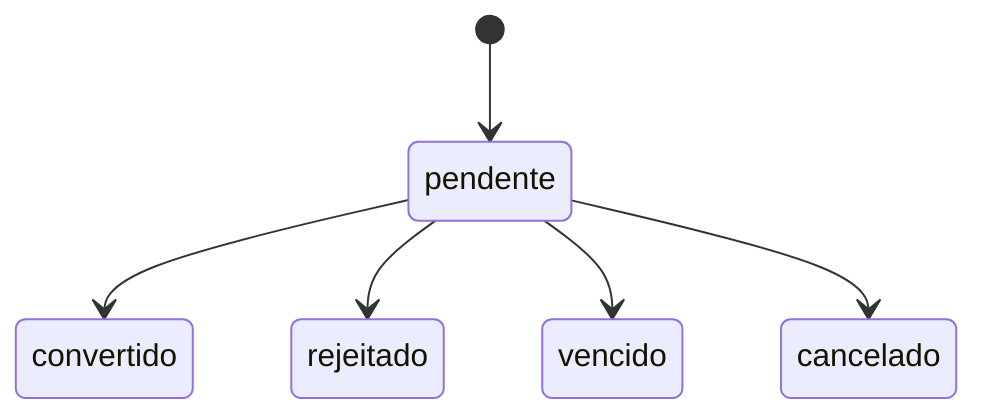

# Contexto – Orçamento (legado CadOrc / migração LACORC)

## Objetivo

Este MCP descreve o domínio de **orçamento** tal como documentado pelo formulário legado **CadOrc** (`TfrmCadOrcamento`) e pelas tabelas Firebird **LACORC** (cabeçalho) e **LACIOR** (itens) da LIGA Infotime. O modelo alvo de persistência na **migração** para PostgreSQL é **`migracao_orcamento`** e **`migracao_orcamento_item`** (prefixo `migracao_`, banco `liga_migracao`).

Um orçamento é uma **proposta** de exames/procedimentos para um cliente, com:

- Até **oito** convênios candidatos no cabeçalho (slots **NUMCO1..8** no legado, **numco1..8** no modelo novo).
- Até **cinco** médicos solicitantes (**NUMMED1..5** / **nummed1..5**).
- **Itens** com código de exame, material, códigos e valores unitários **por convênio** (**COPAF1..8**, **VALCO1..8**) e indicadores **VALMED1..5** (S/N) por médico solicitante.
- **Ciclo de vida** explícito: `pendente`, `convertido`, `rejeitado`, `vencido`, `cancelado` (cancelado por exclusão lógica a partir de `pendente`).

No roadmap atual, **não haverá CRUD de orçamento no infolab-migracao**. Assim, este repositório (**infotime-web**) permanece como fonte canônica da documentação de domínio, com foco em legado + mapeamento conceitual de migração.

---

## SaaS (infotime-web) versus migração (`migracao_*`)

Não confundir o modelo **SaaS** deste repositório com o modelo de **migração**:

| Aspecto | SaaS (`infolab_orcamento`) | Migração (`migracao_orcamento`) |
|--------|----------------------------|----------------------------------|
| Convênios no cabeçalho | **5** FKs (`id_convenio_1` … `id_convenio_5`) | **8** slots inteiros opcionais (`numco1` … `numco8`), legado NUMCO |
| Médicos | **1** FK `id_medico` | **5** slots (`nummed1` … `nummed5`) |
| Cliente | FK `id_cliente`, tenacidade, unidade, catálogos | Snapshot desnormalizado: `num_cli`, `nom_cli`, `sex_cli`, `ter_cli` (como NOMCLI/NUMCLI no legado) |
| Itens | `infolab_orcamento_exame_material` — 5 pares valor/código convênio | `migracao_orcamento_item` — **8** pares **copaf/valco** + **valmed1..5** |
| Rejeição | FK `id_motivo_orcamento_rejeicao` + usuários/datas SaaS | Texto livre `motivo_rejeicao`, `usuario_rejeicao` (e-mail JWT na API planejada) |
| Chave legada | Não aplica | `cod_orc_fb` opcional (CODORC Firebird) |
| Status | Campos de data/usuário SaaS (fechamento, cancelamento, etc.) | Campo único `status` string (`pendente` \| `convertido` \| …) |

As regras deste MCP para fluxo de status e cálculos de listagem descrevem comportamento **conceitual de migração** e referência de negócio. Elas não representam um compromisso de implementação de API no infolab-migracao neste momento.

---

## Referência legada – Firebird

### LACORC (cabeçalho)

| Legado | Significado |
|--------|-------------|
| CODORC | PK numérica do orçamento no Firebird (referência migrada em `cod_orc_fb`) |
| NUMCLI | Número do cliente (FK LACCLI no legado → `num_cli`) |
| NOMCLI, SEXCLI, TERCLI | Nome, sexo (M/F), telefone (desnormalizados → `nom_cli`, `sex_cli`, `ter_cli`) |
| DATINC, HORINC, USUINC | Inclusão legada (no modelo novo: `criado_em` e auditoria interna) |
| OBSORC | Observações (BLOB → `obs_orc`) |
| NUMCO1..8 | Convênios vinculados (→ `numco1`..`numco8`) |
| NUMMED1..5 | Médicos solicitantes (→ `nummed1`..`nummed5`) |
| VALOR_DESCONTO | Desconto (→ `valor_desconto`) |
| DATCON, IDEATE, IDEFIC | Conversão: data, id atendimento gerado, id ficha (→ `data_conversao`, `ideate`, `idefic`) |
| DATREJ, HORREJ, USUREJ, MOTIVO_REJ | Rejeição (→ `data_rejeicao`, `usuario_rejeicao`, `motivo_rejeicao`; hora legada absorvida em timestamp onde aplicável) |
| ID_PROCEDENCIA | Procedência (→ `id_procedencia`) |
| COMPRO | Comprovante (→ `comprovante`) |
| CODIND | Código de indicação (→ `codind`) |
| DATULT, HORULT, USUULT, TIPULT, UNIORI | **Não migrar** (auditoria legada substituída por `criado_em` / `atualizado_em` no projeto novo) |

### LACIOR (itens)

| Legado | Significado |
|--------|-------------|
| CODORC | FK cabeçalho (→ `id_orcamento` + opcional `cod_orc_fb` no cabeçalho) |
| NUMORD | Ordem do item (→ `num_ord`; único por orçamento com `id_orcamento`) |
| CODEXA, CODMAE | Exame / material (→ `cod_exa`, `cod_mae`) |
| COPAF1..8, VALCO1..8 | Código de faturamento e valor unitário por convênio (→ `copaf1`/`valco1` … `copaf8`/`valco8`) |
| VALMED1..5 | S/N solicita médico por slot (→ `valmed1`..`valmed5`) |

---

## Modelo alvo – PostgreSQL (migração)

### migracao_orcamento

- `id_orcamento` — PK BigInt autoincremento.
- `cod_orc_fb` — Decimal opcional; CODORC original.
- Cliente: `num_cli`, `nom_cli`, `sex_cli`, `ter_cli`.
- Convênios: `numco1`..`numco8` (inteiros opcionais).
- Médicos: `nummed1`..`nummed5`.
- `valor_desconto`, `obs_orc`.
- `status` — default `pendente`; valores: `pendente` \| `convertido` \| `rejeitado` \| `vencido` \| `cancelado`.
- Conversão: `ideate`, `idefic`, `data_conversao`.
- Rejeição: `data_rejeicao`, `usuario_rejeicao`, `motivo_rejeicao`.
- Indicação / procedência / comprovante: `codind`, `id_procedencia`, `comprovante`.
- Auditoria interna: `criado_em`, `atualizado_em`.
- Relação 1:N com `migracao_orcamento_item` (cascade on delete).

### migracao_orcamento_item

- `id_item` — PK; `id_orcamento` — FK.
- `num_ord` — ordem; constraint única (`id_orcamento`, `num_ord`).
- `cod_exa`, `cod_mae`.
- `copaf1`/`valco1` … `copaf8`/`valco8`.
- `valmed1`..`valmed5` — Char(1), tipicamente `S` ou `N`.
- `criado_em`.

Índices: `status`, `num_cli` no cabeçalho; `id_orcamento` nos itens.

---

## Ciclo de vida (status)

- Criação inicia em **`pendente`**.
- Apenas a partir de **`pendente`** são permitidas as transições acima; estados terminais **não** retornam a `pendente` no escopo atual.
- **`cancelado`** é o efeito da exclusão lógica (equivalente operacional a “excluir” o orçamento enquanto pendente).

Detalhes de validação (motivo na rejeição, ideate/idefic na conversão, etc.) estão em `mcp/orcamento/rules.md`.

---

## Integração com atendimento e ficha

- No legado, **IDEATE** e **IDEFIC** amarram o orçamento convertido ao atendimento e à ficha gerados.
- No SaaS, `infolab_atendimento.id_orcamento` referencia `infolab_orcamento` após conversão (ver `mcp/atendimento` quando documentado).
- No mapeamento conceitual de migração, o evento de conversão deve preservar `ideate`/`idefic` (pelo menos um dos dois) e `data_conversao`.

---

## Listagem e apresentação (regra conceitual)

- Em uma implementação futura, o comportamento recomendado é: filtro textual em `nom_cli` e `codind` (ILIKE), filtro por `status`, paginação e ordenação por `atualizado_em` descendente.
- Também é recomendado expor agregados `porStatus` e os cálculos definidos em `rules.md` (`valor_total` por item e `valor_orcamento` no cabeçalho da linha agregada).

---

## Referência de UI (se houver implementação futura)

Se o produto voltar a ter implementação dedicada de orçamento, recomenda-se seguir `mcp/padroes/ui` (sidebar, cartões e DataTable quando aplicável):

1. **Listagem `/orcamentos`** — grade com colunas: código FB, nome cliente, contagem de convênios preenchidos, contagem de itens, desconto, badge de status, data de criação; filtros por status e busca por nome; resumo de contagens por status no rodapé; clique na linha abre detalhe.
2. **Detalhe `/orcamentos/[id]`** — cabeçalho (dados cliente, convênios, médicos, desconto, indicação, procedência, observação); badges e blocos condicionais para convertido/rejeitado; ações **Editar**, **Rejeitar** (dialog com motivo), **Converter** (dialog com tipo atendimento vs pré-atendimento, ideate/idefic, data) apenas em `pendente`; tabela de itens com colunas de valor por convênio **visíveis conforme slots preenchidos no cabeçalho**; totais por coluna de valor; em `pendente`, inclusão/remoção de itens inline.
3. **Novo `/orcamentos/novo`** — formulário cliente (abas: cliente; convênios/médicos; financeiro; itens só na criação com ordem automática; valores por convênio podem ficar vazios até o detalhe).
4. **Editar `/orcamentos/[id]/editar`** — cabeçalho editável apenas em `pendente`; itens preferencialmente geridos na página de detalhe (conforme especificação do produto).

Esses pontos de UI são referência funcional e não representam escopo de entrega ativo.

---

## Integração com outros MCPs

- **`mcp/padroes/ui`** — layout de listagem, formulário em seções/abas, dialogs de confirmação.
- **`mcp/atendimento`** — vínculo pós-conversão (`id_orcamento` / fluxo de orçamento no SaaS); ao documentar conversão na migração, referenciar IDs `ideate`/`idefic` de forma consistente.
- Catálogos de cliente, convênio, médico e exame: **fora do escopo inicial** na migração (campos numéricos/códigos como texto); quando houver FKs reais, atualizar este MCP.

---

## Lacunas e evolução

- **`vencido`** — pode ser manual (PATCH) ou automático (job futuro); até existir job, tratar como manual na documentação de release.
- **Coerência de `cancelado`** — garantir no schema Prisma da migração que `status` aceita `cancelado` além dos quatro valores “de negócio” visíveis na listagem padrão.
- **Total comercial** — `valor_orcamento` na listagem (soma dos `valco1` dos itens) e `valor_total` por item (máximo entre `valco1`..`valco8` não nulos) são regras de **apresentação** simplificadas; podem divergir de política comercial real.
